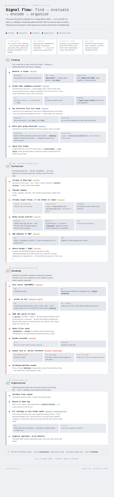

# Video Encoder script

I started this project back in 2024 because my video libraries were getting too large (can't keep buying drives) an I wanted uniformity with the file formats.. (over 10 years in collecting).. so I wanted a way to convert and let it run. HandbrakeCLI does a great job at the conversion but it takes too long to put things in batches.. And I like my data organized where possible.. 

Hence the start of this little project.  It converts, organizes, strips out the old junk metadata (we get things frm "places" and don't want plex or other things to show that, so at the end, you have a nice clean AV1 file or a x265 file.. whichever works best and provides the best size amount. Its been my experience that not every conversion will yield results.. so I put in some logic that if the file is larger, then try as a x265 (if doing AV1). 

This script is portable (because I often have my windows laptop, mac, and linux machines running on this, and had to create like 3 or 6 versions (some for anime, some for flatpack versions of handbrake, some for regular movies and tv shows).. so this script tries to unify them all into an uber script. (the original sources are in the genesis folder to cover the use case specific ones). 

Bash library organizer and batch transcoder for large home-media trees. Targets **MKV + AV1** (kept when not more than **20% larger** than the source) with **x265** fallback, optional **ISO/Blu-ray** disc handling, and **sharded** directory scans for multi-thousand-file libraries.

**Current release:** `convert-v5.1.0C.sh` (v5.1.0C) — see [What's new in v5](#whats-new-in-v5). Structural modularization (v5.1.0A, zero intended behavior change) — the script is now `convert-v5.1.0C.sh` plus a `modules/ves-*.sh` directory that must be deployed alongside it — plus two real bug fixes found via post-modularization regression testing: multi-part movies never being merged (v5.1.0B) and a heartbeat-subshell leak on interrupt (v5.1.0C). See [CHANGELOG.md](CHANGELOG.md) for the full story. Deploying fleet-wide (safe alongside in-progress jobs — running encodes keep using their already-loaded script version; only the next-job pickup uses the new one).

## Logic flow

How a single library folder moves through the pipeline — finding, evaluation, encoding, organization:



## About this project

I started this project back in 2024 because my video libraries were getting too large — I can't keep buying drives — and I wanted uniformity in file formats. After more than ten years of collecting, I needed a way to convert and let it run. HandBrakeCLI does a great job at conversion, but it takes too long to batch things by hand. And I like my data organized where possible.

Hence this little project. It converts, organizes, and strips out old junk metadata. We get things from "places" and don't want Plex or other apps surfacing that, so at the end you have a nice clean AV1 file or an x265 file — whichever works best and gives the best size. It has been my experience that not every conversion yields good results, so I added logic: if the AV1 output is larger than the source, try x265 instead.

The script is portable because I often have my Windows laptop, Mac, and Linux machines working on the same libraries. Over time that meant three or six separate scripts — some for anime, some for Flatpak HandBrake, some for regular movies and TV shows. This script tries to unify them into one uber-script. The original use-case-specific sources live in the [`genesis/`](genesis/) folder.

## What's new in v5

v5 replaces fixed-quality encoding with a **per-title quality floor**: instead of encoding
everything at one CQ and keeping whatever comes out, each title is sampled, and the encoder
searches for the **highest CRF that still meets a VMAF target** — so easy content (sitcoms,
clean digital sources) gets far smaller files, and hard content (grain, action) gets *more*
bits than v4 gave it. Measured against v4's fixed CQ 26, that setting scored roughly
VMAF-NEG 92.6 on typical sources; v5's default floor is **94.0** — higher quality *and*
smaller average size across a library.

- **ffmpeg encode engine** (libsvtav1 / libx265) for files; HandBrake remains for ISO/BDMV
  disc sources and via `--engine handbrake`.
- **VMAF-targeted CRF search**, three-tier by machine capability:
  1. [`ab-av1`](https://github.com/alexheretic/ab-av1) if installed (fastest search)
  2. internal sample-based search using ffmpeg's `libvmaf`
  3. fixed CRFs (v4-equivalent) when the ffmpeg build lacks libvmaf
- **Models per content class**: NEG model (resistant to sharpening/enhancement gaming) for
  SDR movies/TV and anime; the 4K model for UHD sources (`--vmaf-target-4k`, default 95).
- **HDR handled conservatively**: VMAF is unreliable on PQ/HLG, so HDR titles use a fixed
  conservative CRF, and HDR10 static metadata (mastering display, MaxCLL/FALL) is carried
  into the output.
- **Dolby Vision is stripped to plain HDR10** (Plex-first compatibility, VLC second):
  profiles 7/8 keep their HDR10 base layer + static metadata (RPU/EL dropped);
  profile 5 (no HDR10 base) is converted via `libplacebo`; if libplacebo is missing the
  file is flagged for human review instead of producing broken colors.
- **Functional hardware detection**: every candidate encoder (NVENC, QSV, VAAPI, AMF,
  VideoToolbox) is verified with a 1-second test encode — per-codec, per-GPU. A box with
  mixed GPUs (e.g. an Ada/Blackwell card plus an older Ampere card) gets AV1 NVENC only
  where it actually works. `--prefer-hw` opts into hardware encoding (speed over size,
  fixed quality — no VMAF search).
- **Mount audit**: at startup the library path's NFS/CIFS mount options are checked and
  suboptimal settings (e.g. `soft`, small `rsize/wsize`, missing `nconnect`) produce
  advisory recommendations.
- Everything else — organize, sharding, resume, validation, track labeling, size-reject
  safety gates, x265 fallback — carries over from v4.0.52.

New flags: `--engine auto|ffmpeg|handbrake`, `--vmaf-target N`, `--vmaf-target-4k N`,
`--vmaf-samples N`, `--no-vmaf`, `--prefer-hw`, `--svt-preset N`.

**v5 requirements:** ffmpeg built with `libsvtav1`, `libx265`, and (for VMAF targeting)
`libvmaf` — Fedora/RPM Fusion and Homebrew builds qualify; Ubuntu/Debian distro ffmpeg
lacks libvmaf, use a [BtbN static build](https://github.com/BtbN/FFmpeg-Builds/releases).
`libplacebo` (in the same builds) enables DoVi profile-5 conversion. `ab-av1` is optional.

## Version progression

For the full story behind the security and source-file-safety hardening passes
(v5.0.9 → v5.0.30) — what was wrong, why it mattered, how it was found and fixed —
see [CHANGELOG.md](CHANGELOG.md). The table below is the one-line-per-release index.

Each release is a **new file** — prior scripts stay in the repo for reference.
The repo root holds the **current release** (`convert-v5.0.32A.sh`) and the **last v4
release** (`convert-v4.0.52.sh`); all earlier versions live in [`Old Versions/`](Old%20Versions/),
split by major version (`Old Versions/4.x/`, `Old Versions/5.x/`):

| File | Version | Notes |
|------|---------|--------|
| `convert-v4.0.5.sh` | 4.0.5 | Initial v4 release; 8 GB AV1 oversized threshold |
| `convert-v4.0.6.sh` | 4.0.6 | 20% vs-original AV1 policy; `SCRIPT_NAME` check |
| `convert-v4.0.7.sh` | 4.0.7 | Dry-run media inspection (name, format, length, resolution) |
| `convert-v4.0.8.sh` | 4.0.8 | `--skip-av1` / `--skip-x265`; dry-run skips encoder bake-off |
| `convert-v4.0.9.sh` | 4.0.9 | Sequential jobs with live encode progress |
| `convert-v4.0.10.sh` | 4.0.10 | Auto-resume + shard change detection |
| `convert-v4.0.11.sh` | 4.0.11 | Bake-off failures no longer abort the queue |
| `convert-v4.0.12.sh` | 4.0.12 | NVENC AV1 uses `nvenc_av1_10bit` + `slowest` + HQ encopts |
| `convert-v4.0.13.sh` | 4.0.13 | Per-encoder CQ, Dolby Vision/HDR color metadata |
| `convert-v4.0.14.sh` | 4.0.14 | Bake-off per profile class (movie/anime × SDR/HDR) |
| `convert-v4.0.15.sh` | 4.0.15 | Auto-detect NVENC `tune=uhq` vs `tune=hq` |
| `convert-v4.0.16.sh` | 4.0.16 | Validate existing outputs on restart before skip |
| `convert-v4.0.17.sh` | 4.0.17 | First/last 30s decode validation (faster, catches aborts) |
| `convert-v4.0.18.sh` | 4.0.18 | Master log at `--path`; shard logs merged/cleaned at end |
| `convert-v4.0.19.sh` | 4.0.19 | WSL/HandBrake NVENC fallback when nvidia-smi missing |
| `convert-v4.0.20.sh` | 4.0.20 | WSL auto-picks Windows HandBrake (NVENC) + Linux ffmpeg/mkv |
| `convert-v4.0.21.sh` | 4.0.21 | Skip NVENC probe on `--dry-run`/WSL `.exe`; safer logging |
| `convert-v4.0.22.sh` | 4.0.22 | `sudo` + NFS: root writes mount, HandBrake as `$SUDO_USER` |
| `convert-v4.0.23.sh` | 4.0.23 | Read-only NFS: log/resume in `~/.cache/convert-v4/` |
| `convert-v4.0.24.sh` | 4.0.24 | `grep` required (not `rg`); fixes WSL without ripgrep |
| `convert-v4.0.25.sh` | 4.0.25 | Prefers `rg`, falls back to `grep` |
| `convert-v4.0.26.sh` | 4.0.26 | 5-way HW matrix: NVIDIA / QSV / AMD VCE / VideoToolbox / software |
| `convert-v4.0.27.sh` | 4.0.27 | `sudo` sidecar logs use invoking user's home (`$SUDO_USER`), not `/root` |
| `convert-v4.0.28.sh` | 4.0.28 | Auto pipeline: inspect waves of 5 while encoding; `--largest-first` / `--pipeline` / `--encode-batch` |
| `convert-v4.0.29.sh` | 4.0.29 | CIFS/SMB mount helper (`file_mode=0777`); `--mount-share` / credentials env |
| `convert-v4.0.30.sh` | 4.0.30 | `--skip-bakeoff`; auto-skip bake-off on CIFS + software encode |
| `convert-v4.0.31.sh` | 4.0.31 | NVENC AV1 `tune=uhq` probe on WSL; `--nvenc-av1-tune` / `CONVERT_NVENC_AV1_TUNE` |
| `convert-v4.0.32.sh` | 4.0.32 | macOS re-exec under Homebrew bash 4+ (not zsh); VideoToolbox only if `vt_h265` present |
| `convert-v4.0.33.sh` | 4.0.33 | Skip bake-off in software-only mode; AV1 sources sample-tested vs x265 before re-encode |
| `convert-v4.0.34.sh` | 4.0.34 | macOS BSD-awk-safe HandBrake progress parser (fixes false encode failures); numeric job totals |
| `convert-v4.0.35.sh` | 4.0.35 | Ignore benign ffmpeg DTS “invalid” warnings during output validation |
| `convert-v4.0.36.sh` | 4.0.36 | Per-title `{Title}.convert-v4.IN_PROGRESS` flag for interrupted/partial outputs |
| `convert-v4.0.37.sh` | 4.0.37 | Fix resume offset capture (`log_err`); require numeric resume skip |
| `convert-v4.0.38.sh` | 4.0.38 | Probe HandBrake `--keep-subname`; treat empty success outputs as failure |
| `convert-v4.0.39.sh` | 4.0.39 | Matroska EBML/segment bounds + optional `mkvalidator`; `corrupt_files.txt` |
| `convert-v4.0.40.sh` | 4.0.40 | Stricter output metadata gate (duration + video stream) before structure/decode |
| `convert-v4.0.41.sh` | 4.0.41 | `--check-tools` + OS install help; bad processed delete+reconvert; `bad_sources.txt` |
| `convert-v4.0.42.sh` | 4.0.42 | Clearer mkvalidator install guidance (optional; EBML still runs) |
| `convert-v4.0.43.sh` | 4.0.43 | Fix QSV encode probe (check output size before deleting temp dir) |
| `convert-v4.0.44.sh` | 4.0.44 | Discover tools in `$HOME/.local/bin` (macOS/Linux user installs) |
| `convert-v4.0.45.sh` | 4.0.45 | AMD VCN via ffmpeg `hevc_vaapi` when HandBrake lacks vce/vcn (Fedora/mesa) |
| `convert-v4.0.46.sh` | 4.0.46 | Legacy containers (`m2ts`/`mpg`/`wmv`/…); stream-duration fallback |
| `convert-v4.0.47.sh` | 4.0.47 | Fix AV1 sample “unknown decision” (sample logs on stderr) |
| `convert-v4.0.48.sh` | 4.0.48 | Remux-repair source MKV structure errors before encode; else `bad_sources.txt` |
| `convert-v4.0.49.sh` | 4.0.49 | Waive unlimited size-reject on 1080p upscale path |
| `convert-v4.0.50.sh` | 4.0.50 | Upscale keeps only if ≤50% larger than source; else revert to original |
| `convert-v4.0.51.sh` | 4.0.51 | Fix mkvpropedit off-by-one that mangled audio/subtitle language tags |
| `convert-v4.0.52.sh` | 4.0.52 | `--name-glob` / path trailing glob to filter large shelves (e.g. `American/A*`) |
| `convert-v5.0.0.sh` | 5.0.0 | ffmpeg engine, per-title VMAF-targeted CRF, DoVi→HDR10, functional HW probes, mount audit |
| `convert-v5.0.1.sh` | 5.0.1 | set-based resume (`convert-v5.done`): restarts fast-skip unchanged finished sources instead of positional queue anchor |
| `convert-v5.0.2.sh` | 5.0.2 | `-p` accepts a single file directly (in addition to a directory or directory+trailing-glob) |
| `convert-v5.0.3.sh` | 5.0.3 | multi-part source merge (Part1/Part2/CD1/CD2/Disc1/Disc2); `.ogm` source support |
| `convert-v5.0.4.sh` | 5.0.4 | fixes softness (dropped a stray SVT-AV1 tune=0) and restores v4's dialogue-clarity audio boost (dynaudnorm+gain) in the ffmpeg engine |
| `convert-v5.0.5.sh` | 5.0.5 | `--prefer-hw` NVENC AV1 now uses the probed `uhq` tune (matching v4) instead of a hardcoded `hq` |
| `convert-v5.0.6.sh` | 5.0.6 | fixes a Dolby Vision source silently keeping its DoVi tagging when falling back to x265 via the HEVC remux shortcut |
| `convert-v5.0.7.sh` | 5.0.7 | streaming-optimized MKV output, `--clean-junk`, per-directory file-list cache, per-folder done/in-progress semaphores (fixes multi-hour restart enumeration on large TV libraries) |
| `convert-v5.0.8.sh` | 5.0.8 | fixes 1080p-upscale trigger catching near-720p (letterboxed/cropped) sources it shouldn't; new threshold 700 |
| `convert-v5.0.9.sh` | 5.0.9 | `discover_binary()` now prefers a user-built `~/.local/bin` copy (e.g. a libvmaf-enabled ffmpeg) over the system PATH binary; fixes non-interactive SSH runs silently falling back to a libvmaf-less ffmpeg and losing VMAF targeting |
| `convert-v5.0.10.sh` | 5.0.10 | external review fixes: portable awk `match()` (macOS/BSD awk), portable disc-size (no `du -b`), silent `mv -n` organize collisions now warn instead of losing files, O(n²) pipeline queue reads (persistent fd), pipeline job-count never propagating out of its background scan process, file-list cache/folder-done flags now key on max mtime across the whole subtree (fixes permanently-stale TV libraries — new episodes in a Season folder were invisible forever), multipart merging now excludes TV show/season directories entirely (was merging two-part episodes into one file), merge detection no longer runs during the fast pre-scan count, and `--clean-junk-apply` no longer deletes a `.merged.mkv` just because its raw parts were cleaned up (data-loss fix) |
| `convert-v5.0.11.sh` | 5.0.11 | high-effort cross-platform audit (a full independent review pass, verified before applying): done-log fast-resume was silently dead from a call-order bug (init order swapped); file-list cache writes are now atomic (temp+rename, was corruptible mid-write); WSL_INTEROP now forwarded through `sudo` so Windows HandBrakeCLI.exe/nvidia-smi.exe probes don't break when running as root; macOS mount audit no longer breaks on mount points containing spaces; `dir_subtree_max_mtime` now one `python3` call instead of one per subdirectory; external subtitle paths are translated before comma-joining instead of after (was corrupting filenames containing literal commas, e.g. "Movie, The"); replaced non-essential `seq` dependency; and fleet machines sharing the same NFS/SMB library now atomically claim a title before encoding it, instead of racing to write the same output file (also fixed a real staleness-detection bug this surfaced: a confirmed-dead same-host process was still treated as "not stale" for 2 hours) |
| `convert-v5.0.12.sh` | 5.0.12 | round-3 security + source-safety audit (a full independent review pass, all findings independently verified against the code before fixing; one review pass was also invoked but returned no usable output). Source-safety hardening: a source MKV needing container repair is now remuxed into an isolated throwaway temp dir and the true original is NEVER overwritten in place (previously replaced in place after passing validation); `finalize_mkv_output` no longer remuxes/relabels a genuinely-original AV1 file in place just because it happens to already be AV1; a new codec-vs-filename consistency check (a file named `*.AV1.mkv` must actually BE AV1, `*.x265.mkv` must actually be HEVC) plus an mtime-provenance check now guard every deletion of a "processed output" -- an unrelated real file that coincidentally matches our naming convention is flagged for human review instead of deleted; `try_av1_convert`/`try_x265_convert` now refuse outright if the computed output path is identical to the source path under any combination of naming/codec mismatch (would otherwise have `ffmpeg -y` truncate the source before it could even be read); the in-progress flag write refuses to follow a symlink at its predictable path instead of writing through it into whatever it points to. Security: fixed a second eval-based injection path, SMB credentials file now created with a restrictive umask (closes a TOCTOU permission-race window) and cleaned up via an exit/interrupt trap instead of only on the normal-completion path; a leading `-` in `--path` no longer gets misread as a command flag by `find`/`realpath`. |
| `convert-v5.0.13.sh` | 5.0.13 | round-4 security + source-safety audit (a full independent review pass, all findings independently verified; another review pass was invoked again but returned no usable output both times). A prior fix (`~"$SUDO_USER"` replacing eval) turned out to be safe but silently non-functional -- bash tilde expansion never substitutes a variable's value regardless of quoting, confirmed by direct testing; replaced with `getent`/`dscl`/python3 `pwd.getpwnam` lookups (still no eval) that actually work. `try_av1_convert`/`try_x265_convert` now also refuse if the computed output path is a symlink to anything, not just to the source itself (an unrelated real file could otherwise be truncated through it). A general symlink-neutralization guard now covers every other predictable sidecar path (resume state/queue/shards files, the master log, per-folder done/in-progress flags) beyond the per-title flag fixed last round. `chown` no longer follows a symlink when re-owning outputs/sidecar files under sudo. The SMB-credentials cleanup trap now saves and restores whatever EXIT/INT/TERM handler was already registered instead of permanently clobbering it (was silently breaking the interrupt-triggered resume-state save for the rest of the run). Two cache-file temp-write paths (`mkv_structure_cache_invalidate`/`_store`, `filecache_put`) upgraded from a static or PID-based temp suffix to a real randomized `mktemp` name. Fixed a portability bug where a custom mkvmerge/mkvpropedit path containing a space (e.g. a macOS `.app` bundle) silently broke track labeling. |
| `convert-v5.0.14.sh` | 5.0.14 | round-5 audit (a full independent review pass, all findings independently verified; one reviewer finally returned usable output on this attempt after two prior empty runs). Closed three more unguarded write paths of the same class as previous rounds: `process_existing_av1`'s non-MKV AV1-remux branch now gets the same symlink refusal AND an existing-output provenance check (mtime + codec-claim) that `try_av1_convert`/`try_x265_convert` already had; the per-shard scan log and the shard-snapshot `.prev` diff file (both predictable, symlink-writable) are now neutralized like every other sidecar path; the multipart-merge target now refuses to overwrite a pre-existing regular file with no provenance record of this script having created it. Fixed a bug in the *previous* round's own fix: `optimize_mkv_for_streaming`'s new `mktemp` template had a suffix after the `X`s, which BSD/macOS `mktemp` (unlike GNU) does not accept -- would have silently reintroduced the exact predictable-name race it was meant to close, specifically on the fleet's one real macOS machine. Extended `file_size_bytes`'s portable fallback (python3 `os.stat`) to cover non-macOS/non-Linux platforms, matching the pattern already used elsewhere. Confirmed the `eval` in the trap-restoration path added two rounds ago is safe by construction (operates only on bash's own `trap -p` output, never on user/environment data) -- reviewed and left as-is rather than "fixed" for its own sake. |
| `convert-v5.0.15.sh` | 5.0.15 | fixes a real, visually-confirmed Dolby Vision Profile 5 color bug (green/red tint), found via user report on a live Godzilla (2014) encode. Two compounding causes: (1) the `hdr` flag that gates all Dolby-Vision handling in `build_ffmpeg_video_args` was only ever set from a source's standard `color_transfer` tag — but a genuine Profile 5 source has no PQ/HLG tag at the container level by design (its tone curve lives entirely in the proprietary RPU), so the entire DoVi-detection/libplacebo-conversion branch was silently skipped and the raw base layer got encoded with no RPU-based reconstruction; (2) the libplacebo filter string itself used `color_trc=pq`, which isn't a valid value in this ffmpeg build (the correct name is `smpte2084`) — meaning the P5→HDR10 conversion path had never actually worked since it was introduced, just masked by bug (1). Verified with a real before/after frame extraction from the actual affected file: the buggy output is visibly green-tinted throughout, the fixed output shows correct natural greys/whites. |
| `convert-v5.0.16.sh` | 5.0.16 | full Dolby Vision/HDR classification hardening, following a direct three-way independent consultation on whether v5.0.15's fix was the complete permanent solution. All three independently converged on the same four gaps: (1) HLG content (plain, or DoVi profile 8.4) was being unconditionally tagged as PQ (`smpte2084`/`hdr10=1`) by every `hdr=true` path — wrong transfer curve, crushed shadows/blown highlights on real playback; (2) DoVi profile 8 was treated as one case, but `dv_profile=8` alone can't distinguish 8.1 (HDR10 base, safe as handled) from 8.2 (SDR base, was being wrongly forced into HDR/PQ) or 8.4 (HLG base); (3) a source with Dolby Vision side-data but an unparseable profile number fell through to blind PQ tagging with zero reconstruction — the exact shape of source that caused the original Profile 5 bug, just on a different trigger; (4) `--prefer-hw` and the AMD VAAPI encode paths had no Dolby Vision handling at all — a Profile 5 source encoded that way would hit the original tint bug today. Added a single `determine_hdr_mode()` classifier (pq / pq_reconstruct / hlg / sdr / unknown) used consistently everywhere HDR-related decisions are made; unknown DoVi now fails safe (flagged for human review) instead of guessing; `--prefer-hw`/AMD VAAPI now gracefully fall back to software for profile-5/unknown sources instead of silently producing wrong colors, and apply correct PQ-vs-HLG output tagging when they do proceed. Verified with 13 classification test cases covering every profile/transfer-tag combination raised by the reviewers, plus re-confirmation against the actual Godzilla (Profile 5) and Clueless (Profile 8.1-style) files. |
| `convert-v5.0.17.sh` | 5.0.17 | fixes final output/cache files silently ending up `0600` on NFS shares instead of a normal umask-derived mode (e.g. `0644`), reported directly by the user after noticing it on a just-finished encode. Root cause: `mktemp` intentionally creates its temp file at `0600` regardless of umask (closes a symlink-race window — the same rationale as the CIFS credentials file), but the script's atomic "write to a mktemp'd temp file, then `mv -f` it over the real path" pattern never restored a normal mode afterward, so `mv` carried the `0600` straight through onto the real output. Affected `optimize_mkv_for_streaming` (the final `.mkv` itself, confirmed on the actual Clueless (1995) output), `mkv_structure_cache_invalidate`/`mkv_structure_cache_store`, and `filecache_put`. Added `_restore_default_file_mode()` (chmod to `0666 & ~umask` right after each successful `mv`) and applied it at all four sites. |
| `convert-v5.0.18.sh` | 5.0.18 | RAM-backed output staging. The active encode now writes to a tmpfs/ramdisk instead of the real (often NFS) destination, then moves the finished file into place as one sequential transfer — reads tolerate network blips fine via retry, but a stalled/interrupted write on a `hard` NFS mount can block the whole encode, so moving the write off that path removes the risk entirely and also frees the NFS server from sustained write traffic for the whole encode duration. Discovery-first: an already-mounted suitable tmpfs (`/tmp`, `/dev/shm`, `/mnt/ramdisk`, or a `CONVERT_RAMDISK_DIR` override) is used if found; otherwise one is created sized at `CONVERT_RAMDISK_PCT`% (default 40) of *available* (not total) memory, deliberately leaving headroom for the encoder process's own footprint (observed ~6GB RSS on a real Dolby Vision libplacebo encode). macOS has no built-in tmpfs, so creation there uses a real `hdiutil`/`diskutil` RAM disk instead. A pre-flight size-fit check (source file size + 10% margin, since the encoded output is almost always smaller but occasionally isn't) compares the estimate against actual free space on the candidate and falls back to direct-write, unchanged from prior versions, if it doesn't comfortably fit — never a live mid-encode rescue, which would require unsafe partial-file surgery on a still-growing MKV. The `.IN_PROGRESS` semaphore and per-folder logs stay on the source path throughout, so other fleet machines scanning the same library still see accurate in-progress state. Verified with 17 unit tests (discovery, size-fit math, staging decision, finalize-move, and the platform-specific tmpfs/RAM-disk detection) plus a real end-to-end encode confirming the full stage-encode-finalize path inside the actual script, not just the isolated helpers. |
| `convert-v5.0.19.sh` | 5.0.19 | hardens v5.0.18's ramdisk staging after a three-way independent external review explicitly requested to re-audit the new feature against the hard source-file-safety invariant. Two reviewers independently converged on the same two blocking issues: (1) the per-file staged path was a predictable string (`$RAMDISK_JOB_DIR/.convert-stage.$$.basename`) built directly in a shared, world-writable location (`/tmp`, `/dev/shm`) — another local user/process could pre-plant a symlink at that exact name pointing at an arbitrary file (including a source), which `ffmpeg -y` would then follow and write through; (2) `finalize_staged_encode_output`'s `mktemp` created a temp file, but then `cp` reopened that path *by name* to write into it — a TOCTOU window where the path could be swapped for a symlink between the two steps. Fixed by switching to a private, `mktemp -d`-created, mode-700 staging directory (unpredictable name, owner-only access) for every per-file write, both during the encode itself and during the final copy-into-place step — eliminating the predictable-name and reopen-by-pathname classes entirely rather than trying to patch around them. Also fixed, per the same review: `CONVERT_RAMDISK_DIR` now must actually be tmpfs-backed (verified the same way as every other candidate) instead of being trusted blindly; macOS's stale-ramdisk detection no longer has a loose "any mount at this path" fallback that could eject an unrelated volume; Linux's owned-resource detection now checks the path is genuinely its own mountpoint, not just that it lives somewhere under a tmpfs (`/run` itself is tmpfs on Fedora, which could misclassify a stale plain directory); `finalize_staged_encode_output` now explicitly checks `mv`'s exit status and preserves the staged copy for manual recovery instead of silently discarding a successful encode if the final move fails; `ramdisk_job_start` now skips entirely during `--dry-run` (a reviewer-suggested optimization, since dry-run never actually encodes). Verified with 20 unit tests including direct regression tests replicating the exact symlink pre-plant and TOCTOU scenarios both reviewers described, plus real end-to-end encodes on both the primary workstation (discovered `/tmp`) and MAC-HOST (created + torn-down macOS RAM disk) confirming the hardened path end to end. |
| `convert-v5.0.20.sh` | 5.0.20 | A full-script re-audit (three independent external reviewers again, this time against the *entire* file, not just the ramdisk section) found that v5.0.19's staging fix only covered the software-ffmpeg path — every OTHER encoder invocation (`ffmpeg_encode_hw`, `handbrake_encode`, `vaapi_hevc_encode`, `remux_copy_to_mkv`) still opened the final (predictable) output path directly, with only a one-time `[ -L "$out" ]` check from the caller standing between that check and the encoder actually opening the path minutes later during a bake-off/VMAF search — a real symlink-race window. Fixed by extending the same private-staging model to all four of those paths, plus the multi-part merge (`ensure_multipart_merge` now merges into a private `mktemp -d` before renaming into place, same for its cache-state sidecar) and `optimize_mkv_for_streaming` (its `mktemp`-then-`mkvmerge`-reopens-by-path pattern was vulnerable to an attacker actively watching the shared directory, even though the temp *name* was unpredictable — a mode-700 private directory closes that regardless of naming). Also fixed: the `.IN_PROGRESS` semaphore and several other predictable sidecar writes (`resume_persist_state`, `write_queue_snapshot`, the master/shard/done logs, the pipeline's ready-item queue) now either write via a private-temp-then-`mv` pattern (`mv`/`rename()` replaces whatever sits at a destination — including a symlink — directly and atomically, without ever following it) or, for the continuously-appended log files, through a file descriptor opened once at path-resolution time instead of reopening the path by name on every single write. Two more `set -e` correctness bugs: `done_log_load` could silently abort the entire script at startup if the done-log file existed with zero matching entries (fixed with an explicit `if`/`return 0` instead of relying on a bare `[ cond ] && log` as the function's last statement); several `df`/`vm_stat`/`getent`/`dscl` pipelines used in bare command-substitution assignments could abort the script under `pipefail` if any stage failed even when the final stage succeeded (all now guarded with `\|\| var=""`). `--clean-junk-apply` no longer auto-deletes a zero-byte file matching our output naming convention (`*.AV1.mkv` etc.) unless a real corresponding source file is actually found beside it — a genuine (if unusually named) original could otherwise have been deleted based on name and size alone. Verified with 30 unit tests (10 new, covering the local-staging fallback and a direct reproduction of the pre-fix symlink vulnerability against a live pre-planted symlink) plus real end-to-end encodes with ramdisk staging both forced off and left at defaults. |
| `convert-v5.0.21.sh` | 5.0.21 | A fourth round of the same three-way independent external re-audit, run after v5.0.20's fixes. All three reviewers' "critical" findings turned out to be against a stale, not-yet-resynced copy of the repo and were already fixed in the live working file (the fail-open staging fallback, the master-log fd bypass, folder in-progress/done flags, and the pipeline queue files) -- confirmed by diffing the live file before trusting anything. Genuinely new findings that survived verification: `label_mkv_tracks()` called `mkvpropedit` directly on the final output path with no symlink check, so a symlink raced into place between the streaming-optimization remux and this metadata-labeling step could redirect an in-place header edit onto an unrelated real file -- fixed with an `[ -L ]` guard before the edit. `mkv_structure_cache_store()` and `build_shard_snapshot()` both rebuilt their sidecar file via a private `mktemp`+`mv`, but then reopened the same predictable path a second time for a final truncating write/append -- closed by folding every write into the one private tempfile before a single `mv` into place. `source_dovi_profile()`'s bare, unguarded command-substitution assignment could abort the whole script under `pipefail` if Dolby Vision side-data was present but the profile number didn't parse (exactly the "never guess" edge case the classifier exists to handle) -- guarded with `|| dovi=""`. The three lower-frequency bookkeeping logs (`corrupt_files.txt`, `bad_sources.txt`, `reconvert_files.txt`) -- previously accepted as lower-risk since "corrupting these only breaks our own logs" -- got the same fd-based hardening as the master/done logs once it was clear a raced symlink there could redirect appended text into *any* file the process can write, not just another sidecar; the scan-progress files (`convert-scan.total`, `convert-scan.done`) got the equivalent private-tempfile/`mv` and `_safe_touch_empty_flag` treatment. Also added: tracking of the currently-open private local staging directory so a `SIGINT`/`SIGTERM` mid-encode cleans it up instead of stranding it on the destination filesystem. One self-inflicted bug caught by the existing unit-test suite before shipping: the fix for that last item first used a bare `[ cond ] && action` as a function's last statement -- exactly the `set -e` landmine class this whole series of reviews has been hunting -- caught by a test crash and rewritten as an explicit `if`/`fi`. Verified via `bash -n`, the existing 30-test suite (all still passing), and a repo-wide sweep confirming no other instance of that landmine pattern was introduced this round. |
| `convert-v5.0.22.sh` | 5.0.22 | A fleet-wide smoke test (one real source file per machine, all 5) surfaced two follow-ons. First, confirmed (not a bug) that encoder-profile classification is entirely source-path-based, never touching the ramdisk/staging path -- the test's own initial false alarm (files copied into a scratch dir with no `/Anime/` segment) traced back to test setup, not the script. Second, added a genuinely distinct `tv` encoder profile for non-anime `/Television/`/`/TV/`/`/TV Shows/`/`/Series/` content, previously indistinguishable from movies -- new independently tunable `SVT_AV1_CQ_TV`/`NVENC_AV1_CQ_TV`/`FIXED_CRF_SVT_TV`/`FIXED_CRF_X265_TV`/`VMAF_TARGET_TV` (+ `--vmaf-target-tv`), defaulting to movie's existing values since there's no empirical basis yet to diverge. `is_tv_library_path()` now also accepts a bare `TV` folder name. Self-caught: an early draft's `tv` derivation relied on bash `&&`/`||` having C-like precedence, which it doesn't (`A || B && C` is `(A || B) && C`, not `A || (B && C)`) -- rewritten as an explicit `if`/`fi` before shipping. Verified with 18 new isolated unit tests, the existing 30-test suite (unaffected), and a real end-to-end encode confirming `ffmpeg encode (av1 crf=NN, tv)` against a `/Television/`-path source. |
| `convert-v5.0.23.sh` | 5.0.23 | Reported immediately after v5.0.22 shipped: a real library folder (`/Television/American`) mixes adult animation (South Park, Rick and Morty, etc.) in with live-action TV, which path-only `tv`/`anime` detection can't tell apart since both sit under the same folder. Added `--profile movie|tv|anime`, overriding auto-detection entirely for the run -- point it at the specific animated show's folder with `--profile anime` (or force `tv`/`movie` the other direction). Invalid values are rejected immediately rather than silently falling back to auto-detection. A new `FORCE_PROFILE` global is checked first inside both `uses_anime_profile()`/`uses_tv_profile()`; unset (default) behavior is byte-for-byte identical to v5.0.22. Verified with 10 new unit tests (all three override values against both Television and Anime paths) plus a real end-to-end encode: a source placed in a synthetic `/Television/American/` folder, run with `--profile anime`, produced `ffmpeg encode (av1 crf=44, anime)` in the live log. |
| `convert-v5.0.24.sh` | 5.0.24 | Reported after the fleet-wide Rick and Morty test: files across the shared NFS library were coming out with inconsistent, sometimes overly restrictive permissions. Two causes: `_restore_default_file_mode()` (undoes `mktemp`'s forced `0600` after an atomic mv-into-place) computed a umask-derived mode (typically `644`, still single-UID-locked on a multi-machine/multi-account NFS share) -- changed to unconditionally force `0666`. Separately, several `mktemp`+`mv` sites (folder in-progress/done flags, the per-title `.IN_PROGRESS` semaphore, resume queue/state files, shard snapshots, multi-part-merge cache state, scan-progress total) never called the restore helper at all and stayed stuck at `0600` indefinitely -- added the missing call to each, plus an explicit `chmod 0666` after every continuously-appended log file's fd open. Verified with a direct test confirming a fixed flag file now comes out `666` regardless of process umask, plus the existing 30-test suite (unaffected). |
| `convert-v5.0.25.sh` | 5.0.25 | The Rick and Morty comparison test above prompted community-sourced SVT-AV1 best practices for anime (10-bit, preset 4/5, CRF 24-28, `tune=0` for line-art sharpness, ~10s keyframes). Pixel format/preset/keyint were already aligned or better; confirmed this fleet runs mainline SVT-AV1 (not the PSY fork, so `tune=3` isn't valid, only `tune=0`/`1`). `tune=0` was tried fleet-wide in v5.0.0 and reverted in v5.0.4 for making live-action TV softer -- but that finding was never re-tested against anime's different visual character, which the community consensus favors `tune=0` for specifically. Added `tune=0` scoped only to the anime SVT-AV1 params (both the ffmpeg and HandBrake-dispatch paths); movie/tv keep the already-validated default untouched. Tightened the anime fixed-CRF fallback constants (`SVT_AV1_CQ_ANIME`/`FIXED_CRF_SVT_ANIME`) from 35/32 to 26, inside the recommended range -- only affects the HDR/no-VMAF fallback path, not the primary VMAF-targeted search. Verified via `bash -n` and the existing 30-test suite; not yet validated with real playback against genuine anime content. |
| `convert-v5.0.26.sh` | 5.0.26 | A deeper research pass (SVT-AV1's own `Parameters.md` from GitLab, not secondary summaries) found the anime profile's `film-grain=12` was well above the documented 4-6 range for 2D animation -- lowered to `6` in both code paths. Confirmed against the authoritative reference that mainline SVT-AV1's `tune` only has meaningful values 0/1 for our purposes; `enable-variance-boost`/`enable-overlays`/`scd`/`enable-tf=0` were already correctly configured; `aq-mode=2` is redundant (already SVT-AV1's own default) but harmless. Noted, not acted on: a secondary source claims `tune=0` can ring around strong edges in flat-color animation -- deliberately left as-is pending a real playback A/B test rather than a defensive guess. Verified via `bash -n` and the existing 30-test suite. |
| `convert-v5.0.27.sh` | 5.0.27 | Corrected online guidance claiming `tune=2` is an "animation" mode and `-tune animation` is a valid ffmpeg flag for libsvtav1 -- checked against SVT-AV1's own `Parameters.md`: `tune=2` is SSIM-metric tuning (not animation-specific), `tune=3`/"animation" only exists in the SVT-AV1-PSY fork (not installed here), and `libsvtav1` has no top-level `-tune` flag at all (only `-svtav1-params tune=N`, numeric). Added `sharpness=2` (real, documented, range -7..7) alongside `tune=0` for anime -- a more surgical line-art-crispness knob without `tune=0`'s ringing-artifact caveat. Also researched supporting SVT-AV1-PSY fleet-wide per the user's question: zero compatibility risk with VMAF-targeted search (libvmaf scores any file regardless of encoder), but no distro package on 4 of 5 machines -- not pursued given the from-source build/maintenance burden and no confirmed win over mainline yet. Verified via `bash -n` and the existing 30-test suite. |
| `convert-v5.0.28.sh` | 5.0.28 | The Rick and Morty three-way comparison test produced a consistent result: the anime profile's tuning (built for Japanese hand-drawn line art) made this content measurably worse, one episode coming out **larger than its own source** (116.4%). Research confirmed the cause by name: "for shows like South Park and Rick and Morty, film grain should be disabled." Added a fourth profile, `wanime`, for Western flat/vector-style animation -- no path-based auto-detection at all (this content has no reliable folder convention, same reasoning that motivated `--profile`), tuning close to movie/tv's plain settings (film-grain off) plus `sharpness=2` instead of `tune=0` (flat vector art has the sharpest edges, exactly where `tune=0`'s ringing risk is worst). New independently-tunable constants throughout (`SVT_AV1_CQ_WANIME`, `FIXED_CRF_SVT/X265_WANIME`, `VMAF_TARGET_WANIME`) and `wanime` wired into every profile-aware function. Verified with 11 new unit tests, the existing 30-test suite, and a real encode confirming the exact expected SVT-AV1 param string live in the ffmpeg command. |
| `convert-v5.0.29.sh` | 5.0.29 | Found and fixed a real bug, not a tuning problem: the VMAF CRF search encoded probe samples with only base svtav1-params, then the final encode added the profile's film-grain/variance-boost/tune/sharpness extras at that *same* CRF -- since those extras cost real bits, the search's chosen CRF never reflected what the final encode would actually spend, which is what caused v5.0.28's anime-tuning bloat. Fixed by sharing one `svtav1_profile_extras()` function between the search and the final encode, and routing any profile with real film-grain synthesis (anime, and the new `vintage` profile) to the internal search exclusively -- ab-av1's own VMAF scoring has no way to disable synthesized-grain decode (confirmed against an open, unfixed ab-av1 GitHub issue #139), so it would be corrupted by pseudo-random grain the same way ours was. Non-grain profiles (movie/tv/wanime) now pass their extras to ab-av1 via `--svt` so its search stays consistent too. Added a 5th profile, `vintage` (old/grainy live-action masters -- film scans, older TV masters), manual-only via `--profile vintage`: re-enables film-grain synthesis (`film-grain=12`, `enable-tf=1`, lighter `sharpness=1`/`variance-boost-strength=2` than anime) since, unlike movie/tv/wanime, genuinely grainy sources can save real bitrate by letting the decoder regenerate grain instead of the encoder reproducing it as detail; x265 fallback uses the real `tune=grain` value. Design and parameter values cross-checked via independent second opinions (two reviewers consulted this session) before implementation; one factual claim from that research (that SVT-AV1 `tune=2` is "VMAF tuning") was caught and rejected against SVT-AV1's own `Parameters.md` (tune=2 is SSIM; tune=5 is VMAF). Verified with 24 new unit tests plus the existing 30+11-test suites, and `bash -n`. |
| `convert-v5.0.30.sh` | 5.0.30 | The fleet performance test (6 machines, each encoding a unique large 20-27GB movie) surfaced a real mkvalidator bug: mkvalidator v0.6.0 parses the EBML tree via very small sequential reads (~700 bytes/syscall observed), which is fine for typical TV-episode-sized files but drops to ~170KB/s effective throughput on a 20GB+ movie -- tens of hours to validate one file, well before any encoding even starts. Affected every fleet machine that had mkvalidator installed (workstation, MAC-HOST, FEDORA-LAPTOP, WSL-LAPTOP). Fixed with a new `MKVALIDATOR_MAX_SIZE_BYTES` threshold (default 5 GiB, `CONVERT_MKVALIDATOR_MAX_SIZE` env-overridable): above the threshold, mkvalidator is skipped and the existing fast EBML/segment-bounds check (already run first, same check used when mkvalidator isn't installed at all) is treated as sufficient, rather than stalling indefinitely. Applied at all three call sites (`validate_source_media`'s source-encode-time check, the remux-repair verification path, and `validate_mkv_structure`'s output-side check). Lets mkvalidator stay installed fleet-wide (per current policy) without breaking on large movies. Verified via a standalone threshold-logic test (1GB file runs mkvalidator, 6GB file skips it) and `bash -n`. |
| `convert-v5.0.31F.sh` | 5.0.31F | Orphan-process hardening (tracked-child kill on signal/error, a startup reaper for orphans left by a past hard crash, a gated salvage-or-delete policy for a killed orphan's output, and timeout guards on every validation subprocess) plus a replacement of the five-profile encoding system with seven path-detected profiles (WANIME/ANIME/MOVIES/CLASSIC/VINTAGE/MTV/VTV) matching a real library reorganization, and a two-stage cheap upscale-quality test replacing the old unconditional sub-720p→1080p upscale. See [CHANGELOG.md](CHANGELOG.md) for the full story. |
| `convert-v5.0.32.sh` | 5.0.32 | Size-tiered upscale-overshoot guardrail (small/medium/large source-size tiers replace the old flat 50% cap), a display/formula consistency fix for the AV1/x265 rejection warnings (were showing "% of original" mislabeled as "% larger"), and an embedded MKV processed-tag (native Matroska Tags element records exact version + sampled VMAF + resolution when upscaled, survives renames/relocations, used as a second skip signal alongside the done-log). See [CHANGELOG.md](CHANGELOG.md) for the full story. |
| `convert-v5.0.32A.sh` | 5.0.32A | Preexisting-desired-format MKV tagging with codec-specific size gates (AV1 ≤300MB / x265 ≤250MB skip the sample-test entirely), a new x265-source reconsider path (samples for an AV1 or fresh-x265 win instead of blindly re-encoding), unconditional non-MKV-to-MKV remux for both AV1 and x265 sources (container unification), a `force_transcode` fix so a sample-predicted x265 win isn't silently defeated by a same-size remux, and a shared sample-encode fix for a HandBrake NVDEC hardware-decode failure on irregular-timestamp sample clips. See [CHANGELOG.md](CHANGELOG.md) for the full story. |
| `convert-v5.0.32Q.sh` | 5.0.32Q | New upfront audio/subtitle-truncation validation (`validate_mkv_subtitle_tracks`) run before an expensive real encode, plus a fleet-wide crash-safety pass fixing the single biggest class of bug found this project: a bare command whose failure is read via `$?`/`${PIPESTATUS[0]}` on the next line aborts the whole script under `set -e` before that line ever runs. See [CHANGELOG.md](CHANGELOG.md) for the full story. |
| `convert-v5.0.32R.sh` | 5.0.32R | Lowered the preexisting-desired-format size gates (AV1 300→50MB, x265 250→80MB) after a fleet confidence test showed several machines skipping real work under the old caps, plus a new season-level shrink heuristic: within one batch run, if ≥60% of a (show folder, season) group's sample-tested episodes actually shrank, the remaining sample-predicted-no-shrink siblings get one real forced-encode retry instead of trusting that prediction. Went through 3 rounds of independent team review. See [CHANGELOG.md](CHANGELOG.md) for the full story. |
| `convert-v5.0.32S.sh` | 5.0.32S | Full end-to-end team review ahead of the next fleet test, then 3 rounds of fix → re-review: a critical fix for the orphan reaper wrongly disposing another fleet machine's live encode across NFS, a source-corruption false-positive fix (retry before flagging a source bad), cross-host locking for the mkv-structure-cache and done-log, per-host resume-state files, a resource-leak fix, and several smaller correctness fixes. See [CHANGELOG.md](CHANGELOG.md) for the full story. |
| `convert-v5.0.32T.sh` | 5.0.32T | Fixed a real bug found during a full fleet log audit: `process_video()` discarded the real success/failure return code from `process_existing_av1`/`process_existing_x265`, so a genuine encode/validation failure (source needed repair, output also failed validation, correctly discarded) silently logged as "Job complete" instead of "Job failed" — no data lost, but invisible to monitoring and, separately, ineligible for retry on resume. 3-way independently reviewed, all approved. See [CHANGELOG.md](CHANGELOG.md). |
| `convert-v5.0.32U.sh` | 5.0.32U | a proactive full end-to-end team review went 4 rounds of fix → re-review, catching a real cross-host lock-reclaim timing bug, a false-success timeout-propagation gap one call earlier than v5.0.32T's fix, an unlocked scan-vs-live-encode race, and (caught by all 3 reviewers independently) a severe self-inflicted regression where a mutex hardening fix broke `rmdir` on every release. All resolved; unanimous "ship it" after round 4. See [CHANGELOG.md](CHANGELOG.md) for the full round-by-round story. |
| `convert-v5.0.32V.sh` | 5.0.32V | full 8-machine v5.0.32U confidence test passed clean (one genuine content-integrity finding on Crystalight, handled correctly by the script itself). Ahead of the first non-anime (Movies/TV) test this session, a team review targeting profile auto-detection found and fixed a real false-success bug (`process_video()` silently marked profile-detection failures as done); several other findings were checked against the real library structure and found to be either non-issues or currently-unreachable dead code, tracked in ROADMAP.md rather than blocking. See [CHANGELOG.md](CHANGELOG.md) for the full triage. |
| `convert-v5.0.32W.sh` | 5.0.32W | fixes the real cause behind the mixed-content test's "possible stalled mount" failures: `VALIDATION_TIMEOUT_SECS=120` was tuned for anime's smaller episodes and far too short for multi-GB movie/TV files (a healthy validation scan of a 2.59GB file was directly measured taking ~650-700s). New `_validation_timeout_for_args()` scales the timeout by file size (300s/GiB, capped at 1800s) instead of a flat 120s. Team-reviewed; all 3 reviewers independently caught a multi-part-merge under-sizing bug in the first draft, fixed. See [CHANGELOG.md](CHANGELOG.md) for the full diagnostic story (two earlier theories — fleet contention, then NAS scrubs — were investigated and ruled out first). |
| `convert-v5.0.32X.sh` | 5.0.32X | closes the residual gap in v5.0.32W's size-scaled timeout: real NFS timing variance means the same file can take 2x+ longer on one attempt than the next, so even generous scaling occasionally wasn't enough. New `_run_timeout_retry()` retries specifically on timeout (never on genuine file corruption) before giving up, and `MKVALIDATOR_MAX_SIZE_BYTES` lowered to 2GiB so the files where this showed up most skip the slow full scan. Team-reviewed; all 3 reviewers independently caught a real stale-output bug where a timed-out attempt's diagnostic output could survive alongside a successful retry's — fixed by isolating each attempt and replaying only the winning one. See [CHANGELOG.md](CHANGELOG.md) for the full story. |
| `convert-v5.0.32Y.sh` | 5.0.32Y | retunes v5.0.32X's ceiling based on real data: a full 16,615-file library scan showed the 2GiB mkvalidator ceiling excluded 49.6% of real movies (content routinely runs 3-10GB, with a genuine tail to ~69GB). Raised to 10GiB (covers 94.8% of the library), with the timeout rate/cap raised to match (350s/GiB, ~60min cap) based on directly measuring a real 20.15GiB file's healthy scan at ~114 minutes. Sampling and mkvalidator's `--quick` flag were both considered and ruled out as faster alternatives (neither validates the original file's actual structure/truncation state). See [CHANGELOG.md](CHANGELOG.md) for the full story. |
| `convert-v5.0.32Z.sh` | 5.0.32Z | fixes a severe stderr-blackhole bug: a bare `exec {FD}>>file 2>/dev/null` (no command word) permanently redirects the script's own stderr to `/dev/null` for the rest of every run the instant it succeeds — documented bash behavior, not a malfunction, but it meant every `err()`/`warn()` message after the first log-fd setup was silently lost from the terminal on every job, every machine, since that code was introduced. Found across 9 sites fleet-wide (master/done/corrupt/bad-source/reconvert/shard logs, ready-fd close); fixed by group-scoping each redirect onto its `exec` inside a `{ ...; }` block. Team-reviewed by 3 independent reviewers who converged on the same site list unprompted. See [CHANGELOG.md](CHANGELOG.md) for the full story. |
| `convert-v5.0.33A.sh` | 5.0.33A | fixes a real validation gap found by the v5.0.32Z fleet regression test itself: a source with corrupted PTS timing let ffmpeg encode only 324 real frames (~13.5s) into an output whose container still claimed the full ~2hr runtime, and `validate_mkv_decode_windows()` accepted it because it only checked ffmpeg's exit code, never whether real frames were decoded. Fixed by parsing ffmpeg's own frame counter after each validation decode window and failing on zero real frames. Two bugs caught by testing against real files before deploy: a missing `-stats` flag that would've made the check fail universally, and a `set -e`/`pipefail` interaction (caught independently by 3 reviewers) that would've crashed the whole script on exactly the corrupt-file case it was meant to catch gracefully. See [CHANGELOG.md](CHANGELOG.md) for the full story. |
| `convert-v5.0.33B.sh` | 5.0.33B | full E2E code-confidence review of the entire script (~30 findings from a 7-way parallel audit, each independently re-verified with a direct bash reproduction before fixing, which caught several false positives in the audit itself). Fixes include: more `set -e` abort-risk gaps in the VMAF-target lookup, NVENC tune probe, and pipeline-mode hot loop; a variable-scoping bug; a dead-code subprocess-spawn removal; an O(n²) recursive-rescan fix; a cross-host safety gap in the orphan reaper's staging-dir marker (silently-swallowed write failures could let a live encode on another machine get `rm -rf`'d); substantial multi-part source merge hardening (audio-track compatibility, post-merge duration sanity check, part-number contiguity, marker-word disambiguation); and several efficiency fixes. Two rounds of team review both found real issues in the fixes themselves, including two fresh instances of the exact bug class this review was hunting, introduced by the fix code itself. See [CHANGELOG.md](CHANGELOG.md) for the full story. |
| `convert-v5.0.33C.sh` | 5.0.33C | fixes an alarming-but-harmless "Aborted (core dumped)" log message from the AMD VAAPI (and proactively, Intel QSV) hardware-encode capability probes: a driver that genuinely doesn't support the requested profile can SIGABRT instead of exiting cleanly, and bash prints its own unsuppressable-by-redirect crash-looking line for any foreground command that dies by signal. Already handled safely underneath (probe correctly falls back), but looked like a real crash in logs. Fixed by routing the probe through a command substitution instead of a bare foreground statement — verified this suppresses bash's own report while `$?` still captures the real exit code. Team-reviewed, both clean. See [CHANGELOG.md](CHANGELOG.md) for the full story. |
| `convert-v5.0.33D.sh` | 5.0.33D | fixes a false-positive subtitle-corruption deferral found by investigating a "bad source" flagged during the large-scale production-readiness test: `validate_mkv_subtitle_tracks()` only ever checked the first subtitle stream (`s:0`) for cues near the end of the file, so a source whose default-flagged subtitle track happened to be authored empty/broken got permanently deferred as corrupt even when a different, non-default subtitle track on the same file had the complete, valid subtitles (confirmed real case: "The Great Beauty (2013)" — `s:0` was an empty default-flagged track, a later track had full subtitles running to within minutes of the film's true end). Fixed by checking every non-forced subtitle track and only failing if none of them have valid cues in the tail window; ambiguous (timeout/error) results on individual tracks no longer confirm corruption on their own. Team-reviewed, both clean. See [CHANGELOG.md](CHANGELOG.md) for the full story. |
| `convert-v5.0.33E.sh` | 5.0.33E | fixes a silent-hang class of bug found investigating why 3 of 8 fleet machines' jobs died without a trace during the large-scale production-readiness test: several CRF-search/VMAF-scoring/upscale-decision/remux-repair call sites used bare `run_ffmpeg` (no timeout) on short sample clips, so a crashed encoder worker thread (confirmed: SVT-AV1 SIGSEGV on GruntBox2's non-AVX2 hardware) could leave ffmpeg's main thread deadlocked instead of exiting, blocking the entire batch script indefinitely with no recovery. Root-caused via kernel logs (confirmed the crash), systemd session logs (separately confirmed Plex's job was killed by a session-scope teardown on SSH logout, an unrelated `Linger=no` issue), and a code audit that found this exact unbounded-`run_ffmpeg` gap already flagged-but-not-fixed in an existing code comment. Fixed by swapping every short/bounded-duration `run_ffmpeg` call (CRF-search sampling, upscale sampling, SSIM/VMAF comparison, ab-av1 crf-search, and the mkvmerge-fallback remux repair) to timeout-and-retry-wrapped variants — a new, separate, much more generous timeout curve was added for the full-file remux-repair case specifically after team review caught that reusing the short-probe timeout curve there could false-timeout large-but-healthy files. The real full-file encode path (which legitimately runs for hours) is deliberately left untouched. Team-reviewed across two rounds; both independently found one additional call site each round. See [CHANGELOG.md](CHANGELOG.md) for the full story. |
| `convert-v5.0.33F.sh` | 5.0.33F | fixes a fleet-wide, long-standing x265 quality bug found during a post-restart log deep-dive: `tune=animation`/`tune=grain` was embedded inside the `-x265-params` string for the wanime/anime/canime/vintage profiles, but x265's own param parser doesn't accept `tune` as a settable key (it's a whole-preset shortcut applied by a different internal function) — every such encode silently printed `Unknown option: tune.` and got NO tuning applied at all, for the entire project's history, confirmed reproducible identically on every machine tested (not a fleet-version-divergence issue). Fixed by extracting tune into `profile_x265_tune()` and passing it via each interface's own dedicated flag instead (ffmpeg's `-tune`, HandBrake's `--encoder-tune`, ab-av1's `--enc tune=...`) — empirically verified the fix genuinely changes encoder behavior (x265's psy-rd/deblock parameters measurably differ with vs. without the properly-applied tune). Team-reviewed; one reviewer caught one additional dry-run logging gap, fixed in the same pass. See [CHANGELOG.md](CHANGELOG.md) for the full story. |
| `convert-v5.0.33G.sh` | 5.0.33G | legacy-container elimination now has a real floor: when a must-eliminate-format source (avi/ogm/ts/m2ts/vob/disc, now also mpg/mpeg/m2v/rm/rmvb/divx/wmv/flv/asf) fails BOTH AV1 and x265 transcode, the script now falls back to a plain lossless stream-copy remux into MKV instead of leaving the legacy container in place forever. Found and fixed alongside a genuine VFR (variable frame rate) source that failed structural validation on both codecs during the final production test — the script's existing safety net (keep original, log for review) worked correctly there, but the user flagged that legacy containers specifically should never get stuck this way. Required extending the codebase's resume/skip-detection logic (3 functions) and orphaned-staging-file crash recovery (2 functions) so the new remux output is correctly recognized as "done" and doesn't trigger endless reprocessing — caught across 3 rounds of independent team review, including a real bug in my own first-draft fix (a `%q`-quoted command substitution that wouldn't have word-split correctly, replaced with a proper bash array). See [CHANGELOG.md](CHANGELOG.md) for the full story. |
| `convert-v5.0.33H.sh` | 5.0.33H | full end-to-end team review of the entire file (7 parallel section agents + a consolidated independent review pass over all changed functions together). Nine real bugs fixed: a resume-bookkeeping abort risk, 2 bare `rm -rf`/`rm -f` abort risks, 4 bare `mktemp -d` abort risks (all under `set -e`, all now match their own function's existing fallback convention), an orphan-recovery gap for the new bare-`.mkv` remux output (found dead-on-arrival on the final verification pass because the staged-file enumerator never listed that filename shape at all — fixed alongside a too-narrow extension-reconstruction list), and a subtitle-probe ambiguity gap that treated any non-timeout ffprobe error as "confirmed no subtitles." One reviewer's review reported zero bugs; another reviewer and one section agent independently found real, empirically-verified issues, so those were trusted over the clean bill of health. Three architectural items deferred to ROADMAP.md rather than spot-fixed. See [CHANGELOG.md](CHANGELOG.md) for the full story. |
| `convert-v5.0.33I.sh` | 5.0.33I | Found live during the final production-readiness test: Crystalight's RAM disk staging never actually worked, silently falling back to direct-to-NFS writes since the macOS RAM-disk detection function's `diskutil` grep pattern never matched real output. Fixed by scanning `hdiutil info`'s attached-image list for a genuine `ram://` backing instead — empirically verified against the real boot volume, home directory, and the actual RAM disk. See [CHANGELOG.md](CHANGELOG.md) for the full story. |
| `convert-v5.0.33J.sh` | 5.0.33J | A real, previously-undiscovered validation gap found during the same test: a 93min anime movie with subtitle+font attachments produced a truncated video tail on BOTH AV1 and x265 attempts independently; the existing tail-decode check only caught it incidentally. Added a source-duration-anchored video-EOF validation check (defense-in-depth, root mechanism not fully proven) plus a low-risk `-fps_mode passthrough` mitigation. Also fixed a Plex-only `loginctl` linger gap (config-only) that was silently destroying `/dev/shm` staging mid-encode. Team-reviewed, unit-tested. See [CHANGELOG.md](CHANGELOG.md) for the full story. |
| `convert-v5.0.33K.sh` | 5.0.33K | User feedback: disc sources (ISO/BDMV) should be resolved by HandBrake, not punted to manual review. A genuinely ambiguous ISO (two feature-length titles ~29% apart, under the 40% dominance threshold) was being skipped; now tries HandBrake's own `--main-feature` detection first (real disc-structure signals, not just duration), falling back to the existing heuristic unchanged if HandBrake doesn't mark anything. Empirically verified against the real ISO. Team-reviewed: PASS. See [CHANGELOG.md](CHANGELOG.md) for the full story. |
| `convert-v5.0.33L.sh` | 5.0.33L | Follow-up user direction: unify disc-source encoding into the normal ffmpeg pipeline instead of a separate HandBrake-only path. HandBrake now only extracts the selected title losslessly (x264 `-q 0` — FFV1 segfaults on real hardware, discovered via testing) to a local-disk scratch file, symlinked into the media directory and run through the exact same VMAF-CRF-search pipeline as any other file. New `logical_source` threading keeps size/must-eliminate/done-log accounting anchored on the true disc. Verified end-to-end on real infrastructure (PRINCE, WSL-hybrid Windows HandBrake) against the actual "Zu Warriors (2001).iso" — found and fixed one real bug live (scratch-dir permission mismatch across the WSL/Windows interop boundary). Team-reviewed, two design-review rounds plus a final permission-fix review. See [CHANGELOG.md](CHANGELOG.md) for the full story. |
| `convert-v5.0.33M.sh` | 5.0.33M | Team E2E confidence review (requested by the user) found one real bug: the orphan reaper's duration gate always failed for disc-derived candidates, deleting valid hours-of-work AV1/x265 outputs after any crash mid-job instead of salvaging them. Fixed by skipping that gate for disc sources, relying on the structure/tail-decode gates instead. Team-reviewed. See [CHANGELOG.md](CHANGELOG.md) for the full story. |
| `convert-v5.0.33N.sh` | 5.0.33N | Purely diagnostic: the recurring "zero frames decoded near end" bug hit a third time (34/38-subtitle-track streaming releases, not just KanColle's attachment-heavy case), but still doesn't reproduce on a short clip even with the full subtitle set. Two independent reviewers disagreed on the mechanism (muxing-queue exhaustion vs. sparse-stream interleave delta), neither confirmed. Added `capture_validation_failure_evidence()` to preserve the rejected output plus packet-level traces on the next real occurrence instead of deleting the evidence — no change to encode/validation behavior. See [CHANGELOG.md](CHANGELOG.md) for the full story. |
| `convert-v5.0.33O.sh` | 5.0.33O | The "zero frames decoded" truncation bug is fixed: 33N's diagnostic capture proved genuine mid-encode video-stream starvation at a non-fixed point, and a minimal `-max_interleave_delta`/`-flush_packets` mitigation was live-tested and failed. Replaced with a two-stage encode (video+audio only) + cheap stream-copy remux (adds subtitles/attachments back after) — live-tested end-to-end against the real KanColle file, output duration/frame count now match the source exactly. Also: `remux_copy_to_mkv()` no longer fails its whole remux on MP4 `mov_text` subtitles; every final-output path now strips subtitle streams that are flagged but have zero renderable content instead of passing them through as meaningless player selections; `upscale_sample_decision()`'s clip-extraction step no longer fails on legacy AVI sources with irregular timestamps. See [CHANGELOG.md](CHANGELOG.md) for the full story. |
| `convert-v5.0.33P.sh` | 5.0.33P | Fixes a false negative found while building a small fleet-test file for 33O's subtitle content filter: an ASS cue containing only an override block (e.g. `{\an5}`) survived the emptiness check because ffmpeg's SRT muxer wraps styled ASS text in `<font>` tags, leaving non-empty leftover text. Now strips ASS override blocks and HTML-ish tags before judging emptiness. See [CHANGELOG.md](CHANGELOG.md) for the full story. |
| `convert-v5.0.33Q.sh` | 5.0.33Q | Adds a durable `stripped_subtitles.txt` manifest recording every subtitle track stripped for having no renderable content (timestamp, path, stream index, language, title), so there's a punch list of titles to go source replacement subtitles for. Verified end-to-end, plus a full 5-machine fleet test of the subtitle-content filter and two-stage encode/remux pipeline (all clean). See [CHANGELOG.md](CHANGELOG.md) for the full story. |
| `convert-v5.0.33R.sh` | 5.0.33R | Fixes from a full independent review of the 33O-33Q bundle: ambiguous ffprobe/ffmpeg probe failures were silently treated as "confirmed empty subtitle" (real data-loss risk, now tri-state: keep on ambiguous); removed a false-positive bitmap-subtitle stripping check; both AMD VAAPI hw-encode paths and the sample-decision clip extraction were missing the mp4 mov_text fix other paths already had; `remux_copy_to_mkv()` now handles audio-only sources and sets explicit chapter/metadata maps. See [CHANGELOG.md](CHANGELOG.md) for the full story. |
| `convert-v5.0.33S.sh` | 5.0.33S | Adds optional Telegram job-completion notifications (`CONVERT_TELEGRAM_BOT_TOKEN`/`CONVERT_TELEGRAM_CHAT_ID` env vars, off by default): one message per job success/failure, hostname-tagged, fire-and-forget so an unreachable Telegram API never blocks or fails the actual encode. See [CHANGELOG.md](CHANGELOG.md) for the full story. |
| `convert-v5.0.33T.sh` | 5.0.33T | Replaced disc-title extraction's expensive lossless workaround (HandBrake `-e x264 -q 0`, 12+ hours and larger-than-source output) with a genuine zero-recompression stream-copy via ffmpeg's `bluray:` protocol, on both bash and the Windows PowerShell port. See [CHANGELOG.md](CHANGELOG.md) for the full story. |
| `convert-v5.0.33U.sh` | 5.0.33U | Fixed a real performance regression in 33T's fast stream-copy found within hours of fleet rollout: the fast path is fast against a local disc copy but catastrophically slow (~0.27MB/s) against a network-hosted ISO via libbluray's seeky read pattern. Now stages the disc source locally first, then runs the fast stream-copy against the local copy. See [CHANGELOG.md](CHANGELOG.md) for the full story. |
| `convert-v5.1.0A.sh` | 5.1.0A | Structural modularization, zero intended behavior change: the 15,136-line monolith is now a 2,396-line orchestrator sourcing 30 files under `modules/ves-*.sh`, mirroring the Windows PowerShell port's already-proven module boundaries. Requires deploying `modules/` alongside the script — the multi-file deploy mechanism (Phase 0 of this work) was extended to push both atomically. See [CHANGELOG.md](CHANGELOG.md) for the full story. |
| `convert-v5.1.0B.sh` | 5.1.0B | Fixes a real, pre-existing bug found via post-modularization regression testing: multi-part movies ("Title - Part 1.mkv"/"Part 2.mkv", any Part/Pt/CD/Disc separator form) were never being merged, because a generic TV-episode-numbering heuristic misclassified them and the organize phase split them into separate folders before the convert phase could see them as siblings. Fixed with a new shared `MULTIPART_PART_REGEX` exemption in both `is_tv_episode()` and `needs_flat_organize()`; genuine multi-part TV episodes remain protected. See [CHANGELOG.md](CHANGELOG.md) for the full story. |
| `convert-v5.1.0C.sh` | 5.1.0C | **Current** — fixes a real, pre-existing bug: `run_tracked_encoder()`'s periodic in-progress-flag heartbeat subshell could survive for up to 300s after a SIGINT/SIGTERM interrupt, since the trap handler unwound the script before the subshell's own cleanup ever ran. Took three iterations to actually fix (each verified via real interrupt tests) — a plain `kill` doesn't reach the subshell's currently-running `sleep` child, and a naive `pkill -P` issued after the parent is already dead loses the race against kernel reparenting. Final fix snapshots the child PID before killing the parent; team review then caught a `set -e` interaction that could have aborted the whole interrupt-cleanup sequence, fixed in the same pass. See [CHANGELOG.md](CHANGELOG.md) for the full story. |


When bumping version: copy the latest script to `convert-v{NEW}.sh`, update `VERSION` and `SCRIPT_NAME`, keep all older files (moving the superseded one into `Old Versions/`). Do not overwrite.

## Genesis

This project evolved from three small batch encoders in [`genesis/`](genesis/):

- **`convert-v1.sh`** — original Linux/nvdec AV1 encoder (`.avi`, `.mp4`, `.mkv`, `.ts` in cwd)
- **`convert-anime.sh`** — macOS HandBrakeCLI + VideoToolbox, SVT-AV1 anime profile, Opus audio
- **`convert-anime-flatpak.sh`** — same pipeline via Flatpak HandBrake + nvdec

Those scripts scanned the current directory and wrote `{title}-av1.mkv`. v4 keeps the anime encoder profile and GPU paths, and adds organization rules, TV detection, disc title selection, NVENC bake-off, validation, and sharded finds. See [`genesis/README.md`](genesis/README.md) for the full lineage table.

## Environment requirements

The script runs on **Linux**, **WSL2**, **Cygwin/MSYS2/Git Bash**, and **macOS**. It does **not** run in plain Windows PowerShell or CMD.

### Prerequisites (install separately)

These are **not** part of a default Linux, Windows, or macOS install. You must install them (or point the script at them with `CONVERT_*` / `--ffmpeg`, `--handbrake`, …).

| Tool | Required? | Used for |
|------|-----------|----------|
| **ffmpeg** / **ffprobe** | Yes | Probing, remux, validation decode windows, NVENC tune probe |
| **HandBrakeCLI** | Yes | Transcode (AV1, HEVC, disc scan), hardware decode when available |
| **mkvmerge** / **mkvpropedit** (MKVToolNix) | Yes | Subtitle merge, track labels, metadata, output validation |
| **python3** | Yes | Post-encode MKV track labeling (`label_mkv_tracks`; uses stdlib only) |
| **grep** | Yes* | Dolby Vision / HDR detection, encoder probes (*normally preinstalled; required if `rg` is absent) |

On startup the script prints the binaries it picked — that line is the source of truth for your machine.

**Install examples (all required tools):**

```bash
# Fedora / RHEL
sudo dnf install ffmpeg mkvtoolnix HandBrake-cli python3 grep

# Debian / Ubuntu / WSL
sudo apt install ffmpeg mkvtoolnix handbrake-cli python3 grep

# macOS
brew install ffmpeg mkvtoolnix handbrake python3
# grep and python3 are usually present; install python3 if `python3 --version` fails
```

### Optional tools (not required, but improve the workflow)

**Hardware encoding:** For any large library, treat a GPU or Quick Sync / VCE encoder as a practical requirement — see **Hardware-accelerated encoding** below.

| Tool | Platform | Used for |
|------|----------|----------|
| **ripgrep (`rg`)** | All | Faster text search on large ffprobe/HandBrake output (v4.0.25+ prefers `rg`, falls back to `grep`) |
| **NVIDIA driver + `nvidia-smi`** | Linux / WSL / Cygwin | GPU encode detection; script can fall back to HandBrake's NVENC probe |
| **Windows HandBrake** (`HandBrakeCLI.exe`) | WSL2 | NVENC on gaming laptops while ffmpeg/mkv tools stay in Linux WSL |
| **Flatpak + HandBrake** (`fr.handbrake.ghb`) | Linux / WSL | Alternative HandBrake install when distro packages are missing |
| **GNU `timeout`** | Linux / WSL | Caps NVENC tune probe at 120s; script runs the probe without a cap if absent |
| **Homebrew** | macOS | Convenient way to install ffmpeg, MKVToolNix, HandBrake, and python3 |

```bash
# Optional — faster text search (v4.0.25+ logs search=rg when installed):
sudo dnf install ripgrep    # Fedora
sudo apt install ripgrep    # Debian/Ubuntu/WSL
```

**Text search:** v4.0.25+ uses **ripgrep (`rg`) when installed**, otherwise **GNU `grep`**. At least one must be on `PATH`. Startup logs `search=rg` or `search=grep`.

### Baseline OS utilities (no separate install on full distros)

The script also expects standard Unix tools that ship with Linux, macOS, WSL, and Cygwin/Git Bash: `bash` 4+ (macOS: Homebrew bash via auto re-exec), `find`, `sort`, `awk`, `sed`, `stat`, `date`, `mktemp`, `mkdir`, `mv`, `rm`, `basename`, `dirname`, `cut`, `tr`, and on WSL **`wslpath`** (for Windows HandBrake path translation). Minimal container or embedded images may need `coreutils`, `findutils`, and `grep` in addition to the prerequisites above.

Override tool paths with `CONVERT_FFMPEG`, `CONVERT_HANDBRAKE`, etc., or `--ffmpeg`, `--handbrake`, …

### Minimum versions (feature support)

| Component | Minimum | Enables |
|-----------|---------|---------|
| **bash** | 4.0+ | Script runs (Linux, WSL, Cygwin) |
| **zsh** | any recent | macOS — script re-execs under zsh automatically (system bash 3.2 is too old) |
| **HandBrake** | **1.7.0+** | `nvenc_av1_10bit` (GPU AV1 encode) |
| **HandBrake** | **1.6.0+** | `nvenc_h265`, `svt_av1_10bit`, disc/ISO scan |
| **ffmpeg** | **4.4+** | Basic probe/remux; **5.0+** recommended for AV1/HDR validation paths |
| **MKVToolNix** | **60+** | Reliable merge/propedit on modern MKV/HDR outputs |
| **NVIDIA driver** | **525+** (Linux/WSL) / current Studio or Game Ready (Windows host) | NVENC/NVDEC via HandBrake |
| **NVIDIA GPU + NVENC 13+** | RTX 40-series or newer (Ada+) for AV1 encode; most GTX 10-series+ for HEVC NVENC | GPU AV1 (`nvenc_av1_10bit`); script auto-falls back to `tune=hq` if `tune=uhq` is unsupported |

Verify HandBrake encoders:

```bash
HandBrakeCLI --help 2>&1 | grep -E 'nvenc_av1|nvenc_h265|svt_av1'
```

Without a supported GPU, the script uses **software** encoders (`svt_av1_10bit`, `x265`) — correct but much slower.

### Hardware-accelerated encoding (strongly recommended)

For home-media libraries with thousands of files, **hardware-assisted encoding is not optional in practice** — software AV1/x265 on CPU can take many hours per title and will leave a large tree running for weeks. A GPU or integrated graphics encoder is the difference between an overnight batch and a multi-month backlog.

| Vendor | Technology | HandBrake encoders (examples) | In this script |
|--------|------------|-------------------------------|----------------|
| **NVIDIA** | NVENC / NVDEC | `nvenc_av1_10bit`, `nvenc_h265` | **Auto-detected** on Linux, WSL2, and Cygwin — used for AV1 and HEVC |
| **Intel** | Quick Sync Video (QSV) | `qsv_h265`, `qsv_h264` (`qsv_av1` on newer Arc) | **Auto-detected in v4.0.26+** — default priority **below NVIDIA**, above software; `qsv_h265` for HEVC |
| **AMD** | VCE / VCN | `vce_h265`, `vce_h264` | **Auto-detected in v4.0.26+** — default below NVIDIA/QSV; needs amdgpu-pro/AMF on Linux for many distros |
| **Apple** | VideoToolbox | `vt_h265`, `vt_h264` (encode); `videotoolbox` (decode) | **macOS only** — `vt_h265` for HEVC; AV1 via `svt_av1_10bit` with VideoToolbox decode. No NVIDIA/QSV path on Mac |

**What to install for hardware encode:**

- **NVIDIA (Linux / WSL / Windows host):** Proprietary drivers so `nvidia-smi` works (or HandBrake reports NVENC). No CUDA Toolkit required. RTX 40-series+ for GPU AV1; most GTX 10-series+ for HEVC NVENC.
- **Intel:** CPU/iGPU with Quick Sync — ensure your distro HandBrake build includes QSV (`HandBrakeCLI --help | grep -i qsv`). You still need working drivers (`intel-media-driver`, `i915`, etc. on Linux).
- **AMD:** Discrete or APU with VCE/AMF — ensure HandBrake was built with AMF/VCE support and Mesa/AMD drivers are current.

Verify what HandBrake sees on your machine:

```bash
HandBrakeCLI --help 2>&1 | grep -iE 'nvenc|qsv|vce|amf|videotoolbox'
```

**Bottom line:** Run large jobs on a machine with **hardware encode** when possible. **NVIDIA NVENC** is the fastest path (GPU AV1 + HEVC). **Intel Quick Sync** (v4.0.26+) speeds up the HEVC/x265 fallback path substantially on laptops without a discrete GPU. **AMD CPUs** without NVIDIA still use software encoders in this script — fine for small batches, slow for whole regions.

### Hardware combinations (v4.0.26+)

The script probes **all** encoders HandBrake reports, then picks one **active** path. AV1 is always `svt_av1_10bit` (CPU) except when NVIDIA is active (`nvenc_av1_10bit` bake-off).

| # | Hardware | Default active encoder | Override flag | If override HW missing |
|---|----------|------------------------|---------------|-------------------------|
| **1** | AMD CPU + NVIDIA GPU | NVIDIA NVENC | `--prefer-amd-vce` | Software (not NVIDIA) |
| **2** | AMD CPU, no NVIDIA | AMD VCE/VCN → software | — | — |
| **3** | Intel CPU + NVIDIA GPU | NVIDIA NVENC | `--prefer-intel-qsv` | Software (not NVIDIA) |
| **4** | Intel CPU, no dGPU | Intel Quick Sync → software | — | — |
| **5** | macOS | VideoToolbox (`vt_h265`) → software | — | — |

**Default chain (Linux/WSL/Windows, no override):** NVIDIA → Intel QSV → AMD VCE → software

```bash
# Combo 1: AMD CPU + NVIDIA — prefer AMD iGPU/APU encode over discrete GPU
./convert-v4.0.26.sh -p /mnt/Media/... --prefer-amd-vce

# Combo 3: Intel CPU + NVIDIA — prefer Quick Sync over discrete GPU
./convert-v4.0.26.sh -p /mnt/Media/... --prefer-intel-qsv

# Force when HandBrake shows an encoder but auto-detect misses it
export CONVERT_FORCE_AMD_VCE=1
export CONVERT_FORCE_INTEL_QSV=1
export CONVERT_FORCE_NVIDIA=1
```

`CONVERT_FORCE_*` takes precedence over `--prefer-*`. macOS ignores NVIDIA/QSV/AMD flags — VideoToolbox only.

Startup logs: `nvidia=` `intel_qsv=` `amd_vce=` `active_encode=nvenc|qsv|amd_vce|videotoolbox|software`

### Two-machine example (AMD desktop + Intel WSL2 laptop)

| Machine | Typical hardware | What the script does |
|---------|------------------|----------------------|
| **AMD Linux desktop** | No NVIDIA; VCE if amdgpu-pro + HandBrake built with VCE | `amd_vce` or `software` — your AMD box likely lands on **software** unless VCE is in `HandBrakeCLI --help` |
| **Intel WSL2 laptop** | iGPU with Quick Sync | **Use this for big TV/movie jobs.** Install **HandBrake for Windows** on the host; v4.0.26+ auto-picks `HandBrakeCLI.exe` when it reports QSV |

**Intel WSL2 laptop (recommended workflow):**

```bash
# Verify Windows HandBrake sees Quick Sync (run in WSL):
'/mnt/c/Program Files/HandBrake/HandBrakeCLI.exe' --help 2>&1 | grep -i qsv

# Convert a large TV region — Linux ffmpeg/mkv, Windows HandBrake for QSV
sudo ./convert-v4.0.26.sh -p /mnt/BabyBear/Media/Television/American \
  --convert-only --no-shard \
  --handbrake '/mnt/c/Program Files/HandBrake/HandBrakeCLI.exe'
```

Startup should log `WSL hybrid: Windows HandBrake (Intel Quick Sync)` and `HandBrake reports Intel Quick Sync — qsv_h265 for HEVC`. AV1 encodes still use CPU (`svt_av1_10bit`), but when a file falls back to x265 you get Quick Sync hardware speed.

If QSV is present but not detected: `export CONVERT_FORCE_INTEL_QSV=1` or set `--handbrake` to the Windows `.exe` explicitly.

**Note:** Intel QSV inside **Linux WSL** (distro `handbrake-cli`) usually does **not** work — the iGPU is not exposed the same way. The Windows HandBrake hybrid path is the reliable fix, same pattern as NVIDIA gaming laptops.

---

### Linux (native)

**Shell:** bash 4+

**Install:** see **Prerequisites** above (`ffmpeg`, `mkvtoolnix`, `HandBrake-cli`, `python3`, `grep`).

**Optional:** Flatpak HandBrake (`fr.handbrake.ghb`) — auto-detected if distro packages are missing.

**NVIDIA GPU:** Install proprietary drivers so `nvidia-smi` works. No separate CUDA Toolkit is required for NVENC.

On **WSL2 laptops**, GPU detection tries, in order: `nvidia-smi` (including `/mnt/c/Windows/System32/nvidia-smi.exe`), then **HandBrake's NVENC/NVDEC probe**. Override with `CONVERT_FORCE_NVIDIA=1` if needed.

**WSL hybrid toolchain (gaming laptops & Intel iGPU):** Install **ffmpeg + mkvtoolnix + handbrake-cli** inside WSL (Linux packages). Install **HandBrake for Windows** on the host for NVENC (NVIDIA) or Quick Sync (Intel). v4.0.26+ auto-detects `HandBrakeCLI.exe` under `/mnt/c/Program Files/HandBrake/` when it reports NVENC or QSV, while ffmpeg/ffprobe/mkvmerge stay on Linux PATH. File paths passed to the Windows `.exe` are translated via `wslpath -w`. Override only HandBrake if needed:

```bash
export CONVERT_HANDBRAKE='/mnt/c/Program Files/HandBrake/HandBrakeCLI.exe'
# or
export CONVERT_HANDBRAKE_WIN='/mnt/c/Program Files/HandBrake/HandBrakeCLI.exe'
```

**Typical `--path`:** local mount (`/mnt/BigMomma/...`, `/media/...`) or NFS mount configured in `/etc/fstab`.

---

### Windows (WSL2 — recommended)

**Shell:** bash 4+ inside a WSL2 distro (Ubuntu, Fedora, etc.). The script sets `PLATFORM=wsl`.

**NFS / read-only mounts:** If the library mount is read-only for your WSL user (NFS `root_squash`, or SMB mounted without `file_mode`/`noperm`), v4.0.23+ puts **logs and resume state** under `~/.cache/convert-v4/jobs/<path-slug>/` so dry-runs still work. Fix SMB permissions with the mount options under **Mounting media in WSL** when possible so organize/convert can run **without `sudo`**. Use `sudo` only when the share truly requires root for writes; v4.0.22+ runs Windows HandBrake as `$SUDO_USER` in that case.

```bash
# Dry-run / inspect (no sudo needed — log goes to ~/.cache/convert-v4/...)
./convert-v4.0.23.sh -p /mnt/BabyBear/Media/Television/American \
  --handbrake '/mnt/c/Program Files/HandBrake/HandBrakeCLI.exe' --dry-run

# Organize / convert (sudo for NFS writes; HandBrake runs as your user)
sudo ./convert-v4.0.23.sh -p /mnt/BabyBear/Media/Television/American \
  --handbrake '/mnt/c/Program Files/HandBrake/HandBrakeCLI.exe'
```

Use quotes around the HandBrake path. Invoke as `sudo ./script.sh` (not `sudo bash script.sh`) so `$SUDO_USER` is set.

**GPU:** Install current NVIDIA drivers on the **Windows host**. `nvidia-smi` must work **inside WSL**. WSL1 is not supported for this workflow.

**Linux vs Windows binaries:** ffmpeg, ffprobe, mkvmerge, and mkvpropedit are resolved from **Linux WSL PATH** only. HandBrake is special on WSL2 laptops — discovery order:

1. `CONVERT_HANDBRAKE` / `--handbrake` override  
2. Linux `HandBrakeCLI` on PATH (if it reports NVENC or QSV)  
3. **Windows** `HandBrakeCLI.exe` at `/mnt/c/Program Files/HandBrake/` (or `CONVERT_HANDBRAKE_WIN`) when it reports NVENC or QSV  
4. Linux HandBrake on PATH (software encoders)  
5. Flatpak HandBrake (Linux/WSL only)

When the Windows `.exe` is selected, input/output paths are translated with `wslpath -w` so Linux media paths still work.

```bash
# Only needed if HandBrake is not in the default Program Files location:
export CONVERT_HANDBRAKE='/mnt/c/Program Files/HandBrake/HandBrakeCLI.exe'
```

**Recommendation:** **Linux packages inside WSL** for ffmpeg + mkvtoolnix; let v4.0.26+ auto-pick Windows HandBrake for NVENC (NVIDIA laptop) or QSV (Intel laptop).

**Mounting media in WSL:**

| How you access library | WSL `--path` example | Notes |
|------------------------|----------------------|-------|
| NFS (mounted in WSL) | `/mnt/BigMomma/Media/Movies` | Best remote option when the NFS server and network are fast |
| SMB share mounted in WSL (`cifs`) | `/mnt/BabyBear/Media/...` | Mount inside WSL with permissive modes (see below); tune `vers=3.1.1`, large `rsize`/`wsize` |
| Windows drive letter | `/mnt/c/Users/...` | Fine for local NTFS; **slow** for huge trees (drvfs metadata) |
| `\\server\share` only on Windows | Mount into WSL first — avoid encoding through `/mnt/c/...` to a redirected network drive |

**SMB/CIFS in WSL (recommended mount options):** Default SMB mounts often appear read-only to your WSL user (permission mapping / `root_squash`-like behavior). Mount with explicit modes so the script can write logs and outputs **without `sudo`**:

```bash
sudo mkdir -p /mnt/BabyBear
sudo mount -t cifs -o rw,username=YOUR_SMB_USER,password=YOUR_PASSWORD,file_mode=0777,dir_mode=0777,noperm \
  //SERVER_IP/SHARE_NAME /mnt/BabyBear
```

- `file_mode=0777,dir_mode=0777` — WSL user can read/write on the share  
- `noperm` — do not enforce remote ACLs locally (common fix for “Permission denied” in WSL)  
- Optional performance tuning: add `vers=3.1.1,rsize=1048576,wsize=1048576,cache=strict`

**Safer credentials (avoid password on the command line):**

```bash
# /etc/samba/babybear.credentials  (chmod 600, root-owned)
#   username=YOUR_SMB_USER
#   password=YOUR_PASSWORD

sudo mount -t cifs -o rw,credentials=/etc/samba/babybear.credentials,file_mode=0777,dir_mode=0777,noperm \
  //SERVER_IP/SHARE_NAME /mnt/BabyBear
```

**Persistent mount (`/etc/fstab`):**

```
//SERVER_IP/SHARE_NAME  /mnt/BabyBear  cifs  credentials=/etc/samba/babybear.credentials,rw,file_mode=0777,dir_mode=0777,noperm,vers=3.1.1,_netdev,nofail,x-systemd.automount  0  0
```

Then: `sudo mount /mnt/BabyBear` (or reboot). Point the script at e.g. `-p /mnt/BabyBear/Media/Television/American`.

If the share is still read-only, v4.0.23+ falls back to `~/.cache/convert-v4/` for logs/resume; use `sudo` only when you must write MKVs on a root-only NFS mount.

---

### Windows (Cygwin / MSYS2 / Git Bash)

**Shell:** bash 4+; script sets `PLATFORM=windows`.

**Tools:** Install Windows builds of ffmpeg, MKVToolNix, and HandBrakeCLI, or point `CONVERT_*` at `C:\Program Files\...` (script also checks `/cygdrive/c/Program Files/...`).

**GPU:** `nvidia-smi.exe` must be on `PATH` (typically `C:\Windows\System32`).

Less tested than WSL2; prefer WSL2 for large library jobs.

---

### macOS

**Shell:** Homebrew **bash 4+** (v4.0.32+ auto re-execs from system bash 3.2). Install with `brew install bash`. Do **not** run the script via shebang directly from an SMB share (`/Volumes/...`) — macOS blocks that; copy the script to `~/` or invoke `/usr/local/bin/bash /path/to/convert-v4.0.36.sh ...`.

**Install:** see **Prerequisites** above (`brew install bash ffmpeg mkvtoolnix handbrake python3`).

HandBrake is also searched under `/Applications/HandBrake.app/Contents/MacOS/HandBrakeCLI`.

**GPU / hardware encode:** macOS uses **VideoToolbox** only when HandBrake reports **`vt_h265`** (v4.0.32+). Builds that only expose `vt_h264` fall back to software (`svt_av1_10bit`, `x265`). AV1 always uses CPU (`svt_av1_10bit`).

```bash
# Verify VideoToolbox HEVC encoder (required for HW path)
HandBrakeCLI --help 2>&1 | grep -iE 'vt_h265|videotoolbox'
```

**Mounting media:**

| How you access library | Typical `--path` | Notes |
|------------------------|------------------|-------|
| Local APFS volume | `/Volumes/Media/Movies` | Fastest |
| NFS (`mount -t nfs`) | `/Volumes/nfs-media/...` or mount point you chose | Good on gigabit LAN; same latency caveats as Linux NFS |
| SMB (`mount_smbfs`) | `/Volumes/share-name/...` | Very common on Mac; fine for reads, watch write speed during encode. Keep the **script** on local disk. |
| External USB | `/Volumes/MyDrive/...` | USB 3.x+ recommended; USB 2.0 can stall fast encodes waiting on disk |

---

## Optional: distributing the script across multiple machines

If you run this script from more than one machine against a shared library, you don't need anything beyond a shared mount and this repo checked out on each box — but for keeping the script version in sync and pulling logs without repeated `ssh`/`scp`, an optional pattern works well: run an `rsync --daemon` on each machine with two modules — one write-enabled module for pushing a new script version, one read-only module for pulling logs — authenticated via `rsyncd.conf`'s `auth users`/`secrets file` (never pass the password inline on a command line; use `--password-file`). A small stable wrapper script (invoked by cron/systemd instead of a version-named file directly) can `exec` into whichever version a marker file currently names, so version bumps are an atomic file swap rather than an in-place overwrite of a running script.

Optionally, the write-enabled module's `post-xfer exec` hook can auto-verify (checksum + `bash -n`) and atomically activate a freshly-pushed script with no SSH involved in the routine path at all — SSH stays available for actual troubleshooting, not routine distribution.

### Known environment gotchas if you build something like this

These aren't bugs in the script itself — they're host/OS-level things that can silently block an rsync-daemon-based distribution setup, worth knowing about upfront rather than debugging blind:

- **SELinux in `Enforcing` mode (common on Fedora/RHEL)**: the confined `rsync_t` domain cannot execute arbitrary shell scripts by default, which blocks a `post-xfer exec` hook outright — and the client-side symptom is a **false positive**: your push tool may report success while the hook silently never ran, because it only checked "does the marker say the right version" rather than "did the promotion actually just happen." Check `sudo ausearch -m avc -ts recent | grep denied` for `execute`/`execute_no_trans`/`map` denials against `shell_exec_t`/`bin_t` if a push seems to succeed but nothing on the target actually changed. Fix with a narrowly-scoped custom policy module generated from your own actual denials — don't disable SELinux or grant broad access:
  ```bash
  sudo ausearch -m avc -ts recent | audit2allow -M my_rsync_promote
  # review my_rsync_promote.te before loading — it should only grant exactly
  # the file-execute-class permissions your own denials show, nothing broader
  sudo semodule -i my_rsync_promote.pp
  ```
- **WSL2 with "mirrored" networking mode** (`networkingMode=mirrored` in `.wslconfig`): inbound connections pass through a separate Hyper-V firewall layer that an ordinary `New-NetFirewallRule` does not cover at all. Use `New-NetFirewallHyperVRule` instead, run on the Windows host, not inside the WSL2 distro.
- **A hostname that resolves an IPv6 address before its IPv4 one**: an IPv4-only `hosts allow` line in `rsyncd.conf` will silently reject the connection, and rsyncd's error message ("Unknown module") looks exactly like a config typo rather than an ACL rejection. If a module works when addressed by IPv4 literal but not by hostname, this is almost certainly why.
- **macOS's built-in `/usr/bin/rsync`** is often an old `openrsync` build without full daemon/module support — install a current rsync via Homebrew instead. On Apple Silicon, `/usr/local/sbin` may not exist at all (Homebrew uses `/opt/homebrew` exclusively) — create it first if you need to install a hook script there.

---

## Storage, mounts, and performance

The script is **I/O-heavy**: sharded `find` over thousands of folders, ffprobe per file, full source read during encode, and **simultaneous write** of a new `.AV1.mkv` / `.x265.mkv` beside the original. Storage choice affects **wall-clock time** and stability more than it changes compression quality.

### What is affected by slow storage

| Phase | Sensitive to slow/latency-heavy storage? | Why |
|-------|------------------------------------------|-----|
| **Dry-run / inspect** | **High** | Many small metadata reads and ffprobe opens |
| **Organize** | **Medium** | Renames/moves across directories; painful on high-latency mounts |
| **Sharded find** | **High** | Thousands of directory walks |
| **Encode (GPU)** | **Medium–High** | GPU is fast; slow **read** or **write** can leave the GPU idle between buffers |
| **Encode (CPU / Mac)** | **Lower** | CPU encode is slower; storage is less often the bottleneck |
| **Resume / validation** | **Medium** | Extra read passes on outputs |

### Mount types (rough guidance)

| Storage | Typical throughput | Latency | Impact on encoding |
|---------|-------------------|---------|-------------------|
| **Local NVMe / SATA SSD** | Excellent | Low | **Best** — use when possible |
| **Local HDD** | Good sequential, weaker random | Low | Fine for overnight batch jobs; sharded finds take longer |
| **NFS (gigabit+ LAN)** | Good sequential if server is strong | Medium | **Works well** for large libraries (author uses NFS). Ensure stable mount, enough server RAM/disk, and `soft` vs `hard` mount timeout policy you are comfortable with |
| **SMB/CIFS** | Variable | Often higher than NFS | **Usable**; in WSL use `file_mode=0777,dir_mode=0777,noperm` on mount; tune `vers=3.1.1`, `rsize`/`wsize`; avoid Wi‑Fi for multi‑TB writes |
| **USB 3.x external** | Moderate | Low–medium | OK for small batches; large 4K outputs may **throttle** GPU encodes |
| **USB 2.0** | Poor | Medium | **Not recommended** for transcode output |
| **WSL `/mnt/c/` on network redirector** | Poor for metadata | High | **Avoid** for `--path` on huge trees — copy or NFS-mount into WSL instead |

### Recommended: local disk caching for NFS mounts (FS-Cache / cachefilesd)

If the library lives on NFS (the common case above), enable **FS-Cache** on
each Linux/WSL2 client that runs this script — it persists recently-read
NFS blocks to local disk, so a file the script reads more than once (the
3-point sample test, then the full encode; a re-run after a threshold
change; another machine's earlier pass) hits local disk instead of the
network on the second read. This measurably reduces both wall-clock time
and load on the NAS itself across a multi-machine fleet, at zero cost to
correctness (it's a transparent read cache, not a change in what data is
served).

```bash
# Debian/Ubuntu/WSL2
sudo apt-get install -y cachefilesd
# Fedora/RHEL
sudo dnf install -y cachefilesd

# point the cache at whichever local disk has room (defaults to
# /var/cache/fscache — override the `dir` line in /etc/cachefilesd.conf
# if you'd rather use a larger/dedicated local partition)
sudo sed -i 's/^#RUN=yes/RUN=yes/' /etc/default/cachefilesd   # Debian/Ubuntu
sudo systemctl enable --now cachefilesd

# add fsc to each NFS mount's options in /etc/fstab, then remount
sudo sed -i 's/\(vers=4\.[0-9]\)/\1,fsc/' /etc/fstab
sudo mount -a
```

Verify it's actually caching (a running `cachefilesd` process alone doesn't
guarantee the mount is using it):

```bash
# should show `fsc` in the active options, not just fstab
mount | grep nfs

# real proof: second read should be dramatically faster than the first
dd if="$YOUR_PATH/some-large-file.mkv" of=/dev/null bs=1M count=50
dd if="$YOUR_PATH/some-large-file.mkv" of=/dev/null bs=1M count=50
```

**WSL2 caveat:** Microsoft's stock WSL2 kernel has `CONFIG_FSCACHE=y` built
in but **not** `CONFIG_CACHEFILES` — the actual disk-cache backend is
simply absent, and no package install can work around a kernel option
that isn't compiled in. Getting FS-Cache working on a WSL2 fleet machine
means building a custom WSL2 kernel from
[microsoft/WSL2-Linux-Kernel](https://github.com/microsoft/WSL2-Linux-Kernel)
at the tag matching `uname -r`, enabling `CONFIG_CACHEFILES=y`
(`./scripts/config --enable CONFIG_CACHEFILES && make olddefconfig`), then
pointing `.wslconfig`'s `kernel=` at the resulting `bzImage` — a real,
one-time build effort (and a small ongoing one: future WSL2 kernel updates
won't apply automatically to a custom-kernel machine). Weigh that against
how much the machine actually re-reads the same files before taking this
on for a given box.

macOS has no equivalent — its NFS client only offers an in-RAM buffer
cache (not persistent across reboots), and the closest third-party options
(FUSE-based caching filesystems) are either explicitly alpha-quality or not
designed for this use case. Not recommended for a macOS fleet member.

### Practical recommendations

1. **Point `--path` at the fastest mount that holds the library** — same path you would use for Plex/Jellyfin (e.g. `/mnt/BigMomma/Media/Movies/Chinese` on NFS).
2. **Outputs are written next to sources** — you need **free space on that same mount** and enough write bandwidth for files often **larger than the source** during encode.
3. **Do not delete originals** — plan capacity for source + output concurrently.
4. **Remote jobs:** Run the script on the machine with the **GPU**, reading media over NFS/SMB from a NAS, only if the link sustains **hundreds of Mb/s** sustained; otherwise copy a shard locally first.
5. **Wi‑Fi:** Fine for dry-run; risky for long GPU encode sessions writing tens of gigabytes.

### Quick storage sanity check

```bash
# Latency + metadata (matters for huge libraries)
time find "$YOUR_PATH" -maxdepth 2 -type f | head -100

# Sequential read (rough proxy for source throughput)
dd if="$YOUR_PATH/some-large-file.mkv" of=/dev/null bs=1M count=1024 status=progress

# Confirm what the script will use
./convert-v4.0.18.sh -p "$YOUR_PATH" --dry-run 2>&1 | head -8
```

## Quick start

```bash
chmod +x convert-v4.0.18.sh

# Dry-run on a large movies root (sharded by language folder)
./convert-v4.0.18.sh -p /mnt/BigMomma/Media/Movies --dry-run

# Transcode only — one English letter shelf
./convert-v4.0.18.sh -p /mnt/BigMomma/Media/Movies/English/D --convert-only --no-shard

# Skip files already in AV1 or HEVC (e.g. only process h264 sources)
./convert-v4.0.18.sh -p /mnt/BigMomma/Media/Movies --skip-av1 --skip-x265

# Television — preview one region first
./convert-v4.0.18.sh -p /mnt/BabyBear/Media/Television/Thai --dry-run
```

## What it does

### Dry-run inspection (`--dry-run`)

Before organize/convert phases, the script probes each video and disc source with ffprobe/HandBrake scan (no transcoding). Each entry in `convert-v4.log` includes **name**, **video format (codec)**, **length**, and **resolution**.

### Phase 1 — Organize (optional, default on)

- **All movie languages:** loose videos → `Title (YYYY)/Title (YYYY).ext` (years parenthesized)
- **English (large libraries):** A–Z + `0` (digit-led titles) shelves; loose files in any shelf → matching subfolder
- **Articles:** `The` / `A` ignored for shelf *placement* convention only
- **TV:** episodes and show folders under `Television/`, `Anime/`, etc. are **not** reorganized

### Phase 2 — Convert (default on)

- Queue sorted **largest first**, processed **one file at a time** with live HandBrake progress (`Job 3 of 47`, percent complete, ETA)
- **Auto-resume:** interrupted runs continue from the last incomplete file, or the next file after a completed one (`convert-v4.state` in the search path; `--no-resume` to start fresh)
- **Shard tracking:** compares `convert-v4.shards` between runs and logs added/removed/changed shards and new files
- **AV1** (svt_av1_10bit or nvenc_av1_10bit) kept when output is not more than **20% larger** than the source; else **x265** / nvenc_h265
- Oversized AV1 (>20% vs original): 60s mid-file sample test before x265 retry
- **ISO** and **BDMV** discs: auto-pick dominant title (>40% longer than all others); ambiguous discs skipped and logged
- Originals are **never** deleted; outputs are `{Title}.AV1.mkv` or `{Title}.x265.mkv`
- Session log: `{--path}/convert-v4.log` — single master log for the whole job (`tail -f` here). Runtime `[convert]` lines and stats both land here; never written to movie subfolders.
- Per-shard scan logs (`convert-v4.shard.log`) may appear briefly under shard directories during sharded finds; they are merged into the master log and deleted when the session ends. Orphan `convert-v4.log` files under subfolders (e.g. from older per-movie runs) are merged and removed on startup/finalize.

## Large paths and sharding

Default `--shard-depth 1` discovers top-level subdirectories under `--path` and runs `find` per shard.

- **Movies** under `Movies/English/` → shards are letter buckets (`A`, `B`, …) — sharding helps
- **TV region** under `Television/American/` → shards are **show folders** (~1,000+) — use `--no-shard` instead
- **TV root** under `Television/` → shards are regions (`American`, `Thai`, …) — default is fine

```bash
# Movies — shard by language (default)
./convert-v4.0.18.sh -p /mnt/BigMomma/Media/Movies

# English only — shard by letter bucket (A, B, C, …)
./convert-v4.0.18.sh -p /mnt/BigMomma/Media/Movies/English --shard-depth 2

# Small tree — single find
./convert-v4.0.18.sh -p /mnt/BigMomma/Media/Movies/English/D --no-shard

# TV region with ~1,000 show folders — single find (do not use default sharding)
./convert-v4.0.23.sh -p /mnt/BabyBear/Media/Television/American --convert-only --no-shard
```

## Common options

| Flag | Purpose |
|------|---------|
| `-p`, `--path DIR` | Root to scan (required) |
| `--dry-run` | Log actions only; inspect each file (name, codec, length, resolution) without converting |
| `--skip-av1` | Skip sources whose video codec is AV1 (inspection still runs) |
| `--skip-x265` | Skip sources whose video codec is HEVC/x265 (inspection still runs) |
| `--organize-only` | Phase 1 only |
| `--convert-only` | Phase 2 only |
| `--shard-depth N` | Shard find at depth N (default: 1) |
| `--no-shard` | Single `find` over entire `--path` (recommended for `Television/American`-scale trees) |
| `--no-resume` | Ignore saved resume state and process the full pending queue |
| `--ffmpeg`, `--handbrake`, … | Tool path overrides |
| `--help` | Full usage |

Environment overrides: `CONVERT_FFMPEG`, `CONVERT_HANDBRAKE`, etc.

## Television behavior

Under paths like `/mnt/BabyBear/Media/Television`:

- **Organize:** skipped for normal `Show Name/S01E01 …` layouts (episodes stay in show folders)
- **Convert:** every episode without a canonical `.AV1.mkv` / `.x265.mkv` output is transcoded (same rules as movies)
- **Sharding:** depends on what you pass as `--path` (see below)

### Sharding and large TV regions

| `--path` | Default `--shard-depth 1` means | ~shards on BabyBear |
|----------|----------------------------------|---------------------|
| `/mnt/.../Television` | One shard per **region** (`American`, `Thai`, …) | Few (good default) |
| `/mnt/.../Television/American` | One shard per **show** (`30 Rock`, `Abbott Elementary`, …) | **~1,000+** (slow startup) |

`American` has on the order of **1,000 show folders** and **40k+ episode files**. Default sharding at that path runs **one `find` per show** (plus per-shard logging and shard snapshot work) before the first encode — often slower than a single tree walk on SMB/NFS.

**Fastest ways to start on a big TV region:**

```bash
# 1) Full region — one find, skip organize (TV doesn't need it), start encoding
./convert-v4.0.23.sh -p /mnt/BabyBear/Media/Television/American \
  --convert-only --no-shard \
  --handbrake '/mnt/c/Program Files/HandBrake/HandBrakeCLI.exe'

# 2) One show — quick dry-run or convert (~100–200 episodes, seconds to enumerate)
./convert-v4.0.23.sh -p "/mnt/BabyBear/Media/Television/American/30 Rock" \
  --convert-only --no-shard --dry-run

# 3) Work region-by-region from Television/ (few shards — default depth 1 is fine)
./convert-v4.0.23.sh -p /mnt/BabyBear/Media/Television/American \
  --convert-only --no-shard   # still use --no-shard when path IS American
```

**Avoid full-tree `--dry-run` on `American`** unless you want to wait a long time: Phase 0 runs **ffprobe on every file** (~40k probes). Use dry-run on a single show, or skip dry-run and let convert skip episodes that already have complete outputs.

**Other tips:**

- `--skip-av1` / `--skip-x265` — skip sources already in those codecs (still scans the tree; inspection still ffprobes when `--dry-run` is set)
- Resume (`convert-v4.state` in the job sidecar dir) continues the queue after interrupt; the tree is still rescanned on each launch
- First encode per profile runs a short bake-off sample; after that, encoding proceeds one file at a time

Run dry-run on **one show** before converting an entire region.

## Discs (ISO / Blu-ray)

HandBrake treats `.iso` files and folders containing `BDMV/` as disc sources. The script scans titles and converts the longest only when it is more than **40% longer** than every other title; otherwise it logs:

> Unable to Determine which title you wish to convert, process this manually

## Contributors

- **Minnie** (Yorkie) — watches a lot of this with me
- **Di-Di** (Maltese) — watches a lot of this with me

## License

MIT — see [LICENSE](LICENSE).
