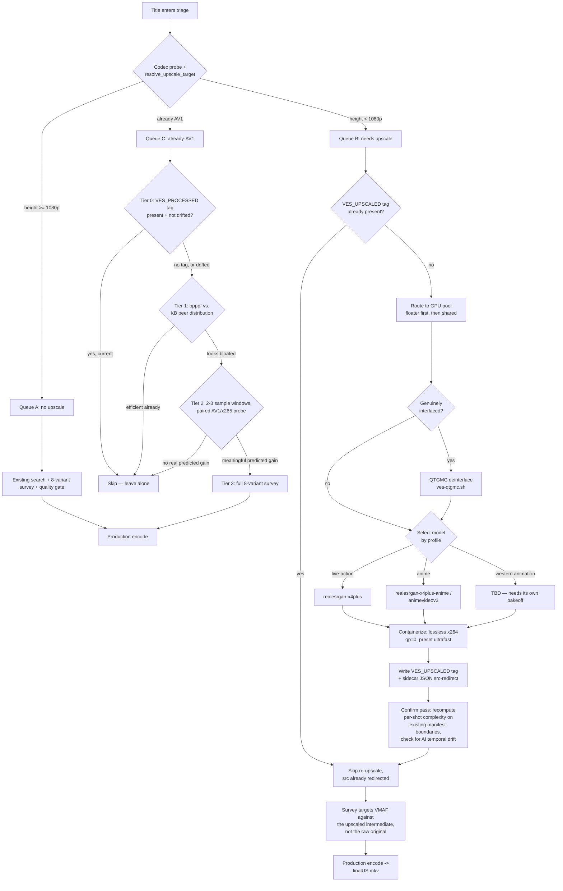

# D-val Upscale Pipeline — Design Doc

Status: **built and deployed, feature-gated off by default** (as of
2026-09-15, v6.0.12 — `DVAL_UPSCALE_ENABLE=1` to turn it on). This document
is the single source of truth for the design — implementation follows it,
and it's kept updated as the build evolves (matching the standing-update
convention already used for [D-VAL-OPERATIONS.md](D-VAL-OPERATIONS.md)).
Core mechanisms (sidecar/resolve/tagging/triage/tool availability on all 4
GPU hosts, **including the Windows port for PRINCE/ELVIS**) are
live-smoke-tested against real files; a full end-to-end ~5hr title through
the whole chain has not been run yet. See "Known gaps" at the end for
exactly what's still open.

## Why this exists

Investigating why M.A.S.H. S01E01/S02E02 blew the production size guardrail
on both AV1 and x265 (see `D-VAL-OPERATIONS.md`'s v6.0.11 changelog entry)
led to a live A/B measurement: upscaling SD content straight to 1080p costs
~2.9x the output bytes of native at matched quality, vs. ~2.25x for SD->720p
— which is why the resolution policy was revised (v6.0.11: SD always caps at
a 720p target, never straight to 1080p). That same investigation opened a
second question: since any interpolation-based upscale (lanczos) necessarily
*softens* the image (it invents no new detail, just spreads existing pixels
over more area), should this pipeline instead target genuinely *sharper*
output using AI super-resolution (Real-ESRGAN), accepting that it trades
strict fidelity-to-source for perceptual quality? A real bakeoff (M.A.S.H.
S02E02, downscale-then-reconstruct methodology, VMAF against real ground
truth) confirmed the tradeoff is real: Real-ESRGAN scored *lower* on VMAF
(75.7 vs. lanczos's 92.3) despite being **visibly sharper and more detailed**
on direct crop comparison — a well-documented property of GAN-based
super-resolution (the "perception-distortion tradeoff"). Given the stated
goal is a sharper *look*, not strict pixel fidelity to a soft SD source, this
pipeline is worth building.

The real cost: ~0.48s/frame on an RTX 5080 for the AI upscale pass alone —
roughly **5 hours per 25-minute episode** before the final encode even
starts. That cost is the reason this is its own pipeline stage with its own
GPU-aware scheduling, not a filter swapped into the existing default path.

## Architecture overview: 3 queues

Every title gets triaged, cheaply, before the expensive manifest+search
phase starts:

- **Queue A — no upscale needed** (source already >=1080p). Highest
  priority. Unchanged from the current pipeline in every respect.
- **Queue B — needs upscale** (source <1080p). Medium priority for the
  *shared* GPU hosts; guaranteed baseline throughput via one reserved
  floater host regardless of what else is queued.
- **Queue C — already AV1** (checked last, lowest priority). Covers both
  this pipeline's own past output *and* third-party AV1 files that entered
  the library pre-encoded. A tiered, cheap-first check decides whether a
  full re-survey is even worth attempting.

This is a scheduling/ordering overlay on the existing `dval_dispatch.sh`
loop, not three separate pipelines — Queue A's processing is completely
unchanged; Queue B and C add pre-stages in front of the same existing
survey+production machinery.

## Flow diagram



## Queue B detail

### Pre-check
Before anything else: does the title's sidecar JSON (see below) already
show a `VES_UPSCALED` stage? If so, skip straight to survey using the
already-redirected `src` — never re-upscale.

### GPU-aware routing and scheduling
Upscale work is restricted to the fleet's 4 GPU-capable hosts, confirmed
live 2026-09-15:

| Host | GPU(s) | Tier |
|---|---|---|
| MJACKSON | RTX 5080 + RTX A4500 (NVIDIA) | Strong — measured ~0.48s/frame |
| PRINCE | RTX 4070 Laptop (NVIDIA) | Strong |
| JJACKSON | Radeon RX 7600 (AMD) | Mid |
| ELVIS | GTX 1650 (NVIDIA, 4GB) | Weak — entry-level, avoid for full episodes |

Non-GPU hosts (AI-PROCESSOR, LAYTOYAJ, STING, RANDYJ, MARLONJ) are excluded
entirely — a CPU/software-Vulkan fallback technically exists but is
impractically slow.

**Priority**: Queue A (non-upscale) is the highest priority in the whole
system. Queue B is medium priority on the *shared* GPU hosts (MJACKSON,
PRINCE, ELVIS in this design) — it waits if one of those is busy with
higher-priority work. But **one GPU host is a dedicated upscale floater**
so there's always guaranteed baseline throughput for Queue B regardless of
what else is queued: **JJACKSON**, chosen because it's *already* the
existing encode-tier floater in `dval_paths.sh`'s strength-tiered model
(`DVAL_ENCODE_TIER_FLOATER`) — extending its existing 2-state
survey/encode logic to a 3rd (upscale) state is the lowest-risk fit, not a
new mechanism. When Queue B is empty, JJACKSON reverts to its current
encode/survey behavior exactly as today — the floater is dynamic, not a
permanently siloed machine.

Tool choice: `realesrgan-ncnn-vulkan` specifically (not a CUDA/PyTorch
build) — it's Vulkan-based and works across both NVIDIA and AMD hardware
via one binary, required given the fleet mixes both vendors.

### Deinterlace-first for genuinely interlaced sources
If a title's `field_mode` is confidently `interlaced`, route through the
existing QTGMC/VapourSynth chain (`modules/ves-qtgmc.sh`, already proven
live on MJACKSON) *before* the AI upscale step, rather than feeding raw
interlaced frames to the upscaler. **Not yet validated how much this
helps** — flagged as an open item below.

### Model selection by content profile
| Profile bucket | Model |
|---|---|
| Classic/vintage TV, movies, concerts, standup (live-action) | `realesrgan-x4plus` |
| Anime / Japanese animation (`anime-*`, `anime-modern-*`) | `realesrgan-x4plus-anime` or `realesr-animevideov3` |
| Western animation (`wanim-*`) | `realesrgan-x4plus` (live-action model) — see below, resolved 2026-09-15. |

### Containerizing the upscale output
Real-ESRGAN outputs a sequence of lossless PNG frames. Reassemble with
**lossless x264** (`ffmpeg -c:v libx264 -preset ultrafast -qp 0`) — see
rationale above: mathematically lossless, fast (no rate-control search),
fully standard/compatible with every other ffmpeg/ffprobe operation this
pipeline already does, and keeps the total lossy-generation count at 2
(source, final encode) instead of 3.

### Source redirect: sidecar JSON
Given a source `/path/Title (Year)/Title (Year).ext`, a same-named sidecar
`/path/Title (Year)/Title (Year).json` redirects consumers to the WORK
subfolder:

```json
{
  "stage": "pending | upscaled | surveying | final",
  "method": "realesrgan-x4plus-720p | realesrgan-x4plus-anime-720p | lanczos-720p | ...",
  "intermediate": "/path/Title (Year)/WORK/Title (Year)-intUS.mkv",
  "final": "/path/Title (Year)/WORK/Title (Year)-finalUS.mkv",
  "created_utc": "...",
  "updated_utc": "..."
}
```

Every consumer (searchwalk, dispatch, worker_encode, finalize,
finalize_worker) resolves through one new helper, e.g.
`_dval_resolve_src(path)`, which checks for the sidecar and returns the
redirected path if present — resolved fresh every call, never a cached or
mutated copy of `dval_titles.sh`'s static entries. This avoids the
half-migrated-state risk of trying to atomically rewrite state across
manifests/fingerprints/KB/redis.

**Retention**: original source, upscaled intermediate, and final encode are
all deliberately kept for comparison. No cleanup policy defined yet — a
real, ongoing storage cost, not free. Temp PNG frame dumps used *during*
processing (distinct from the 3 retained files) do need their own cleanup
and are not part of the retention decision.

### Reusing the existing shot manifest, plus a confirm pass
Upscaling doesn't change duration or frame count, so the existing shot/cut
*boundaries* (timestamps) from the original search should still be valid —
full scene redetection is not needed. But frame-independent AI upscalers
(Real-ESRGAN included) are a known source of frame-to-frame **temporal
flicker** in fine hallucinated detail, which could corrupt per-shot
complexity/motion scoring even though cut *locations* never move. The
confirm pass is scoped narrowly to that specific risk: recompute just the
per-shot complexity signal on the upscaled version at the existing boundary
timestamps, compare against the original's per-shot signal, flag anomalous
shifts. Not a full re-search.

### Re-entering survey
Once tagged and confirmed, the title re-enters the normal 8-variant survey
+ quality gate — unchanged machinery, just pointed at the upscaled
intermediate (via the sidecar redirect) instead of the raw original. This
is also the mechanism that makes "sharper is the goal" actually work: VMAF
targets are now measured against the sharpened intermediate, not the
original soft source, so the CRF search isn't fighting the sharpening.
**Not yet validated** that the sharper look survives a real VMAF-targeted
compression pass — see open items.

## Queue C detail: already-AV1 improvability check

Covers two sub-cases with different available evidence:
- **This pipeline's own past output** — has KB/tag history, can compare
  against a recorded original.
- **Third-party AV1** (entered the library pre-encoded) — no `VES_PROCESSED`
  tag, no original to compare against, only the file itself as evidence.

A tiered, cheapest-first escalation, each tier only running if the previous
one didn't resolve the question:

- **Tier 0 (near-free, metadata only)**: `VES_PROCESSED` tag present and
  current (via the existing `mkv_ves_tag_tools_drifted()` version-drift
  check)? Skip entirely. Third-party files have no tag, so they always fall
  through to Tier 1 — this is expected, not a failure.
- **Tier 1 (cheap, ffprobe only, no decode)**: compute real bits-per-pixel-
  per-frame from container metadata, compare against the KB's existing
  distribution of real bpppf values for similar profile/content-type
  (already have this data across 190+ titles' `outcomes/*.json`). Bloated
  relative to peers -> continue; already efficient -> skip.
- **Tier 2 (minutes, 2-3 sample windows)**: reuse
  `find_complexity_sample_points()` plus a paired AV1-vs-x265 sample encode
  (same style as the existing `upscale_sample_decision()`), extrapolate
  size/VMAF, compare against the file's real numbers. This is the only tier
  that can actually answer "would x265 beat this AV1" — no metadata
  shortcut exists for that question.
- **Tier 3 (expensive)**: the full 8-variant survey, only if Tier 2 showed
  a real predicted improvement.

## Tagging

Two tags, same underlying `_mkv_write_single_tag()`-style embed (Matroska
`<Simple>` tag via mkvpropedit), no collision risk since they land on three
separate physical files:

- `VES_PROCESSED` (existing, unchanged) — on the final encoded output.
- `VES_UPSCALED` (new) — on the WORK-dir intermediate, records which
  method/model produced it (e.g. `"VES ${VERSION} Upscaled -
  realesrgan-x4plus-720p"`) so a future model change (e.g. after the
  western-animation bakeoff lands) can identify which existing intermediates
  used an outdated method and are candidates for redo — mirrors
  `mkv_ves_tag_tools_drifted()`'s existing drift-detection pattern.

## Plex exclusion

The intermediate keeps the source's original file extension (it's upscaled,
not yet encoded to AV1/x265), so Plex has no natural way to distinguish it
from real content without an explicit exclude. Directory-level exclusion via
`.plexignore` (gitignore-style glob, natively supported by Plex), not a
filename regex:

- The pipeline writes a `.plexignore` file containing `*` as the **first**
  action when creating a title's `WORK/` folder — before any real content
  lands in it, closing the race where a scan could discover a file before
  the exclusion exists.
- One-time manual backstop: a `.plexignore` at each Plex library root (e.g.
  `/mnt/BigMomma/Media/`, `/mnt/BabyBear/Media/`) with a recursive pattern
  like `**/WORK/`, covering any `WORK/` folder even outside this pipeline's
  own code path.
- Separately, **not yet built**: `ves-pipeline-scan.sh`'s own recursive
  library scan has no exclusion for `WORK/` either — needs the same
  treatment as the existing `.AV1.mkv`/`.x265.mkv` derived-output exclusion,
  or the scanner will mistake intermediates for new unconverted source.

## Monitoring / tracking

Unchanged from the existing, working scheme — no new mechanism. Small
tracking/dedup artifacts (status, heartbeat, stage markers, "already
notified" flags) go through redis, matching the v6.0.9 redis-native state
migration already in place everywhere else in this pipeline. Verbose raw
output (ffmpeg/`realesrgan-ncnn-vulkan` progress logs) stays as files, same
as `dval_encode_<slug>_<host>.log` does today — redis isn't a log
aggregator, and nothing else in this pipeline uses it that way.

## Failure/retry

Reuses the existing model exactly — no new mechanism: `DVAL_MAX_STRIKES`-style
strike/quarantine, the existing heartbeat-renewal pattern for host mutex
claims, `notify_telegram` for ALERT/RESOLVED-shaped messages. The upscale
stage is a new *place* strikes/heartbeats apply, not a new *kind* of
failure handling.

## Validated 2026-09-15 (real tests, evidence below)

- **Sharper-survives-compression: CONFIRMED.** Built a matched pair — the
  same M.A.S.H. S02E02 window upscaled to the real 720p pillarbox target
  two ways (Real-ESRGAN x4plus, and plain lanczos matching current
  production behavior), both containerized losslessly (x264 `qp=0`), both
  encoded through a *real* SVT-AV1 pass at CRF 27 (matching what production
  actually chose for this content) with identical grain-synth settings.
  Direct crop comparison of the two **final compressed deliverables**
  (not the lossless intermediates) shows the AI path is still clearly,
  visibly sharper than the lanczos path after matched-CRF compression —
  jacket texture, collar edges, fine detail all more defined. VMAF of each
  final output against its own uncompressed intermediate came out nearly
  identical (AI 93.89 vs. lanczos 93.87) — both paths preserve a similar
  *relative* fraction of their own reference under compression, and the
  AI path's absolute sharpness advantage survives on top of that. This was
  the single biggest open risk in the whole plan and it resolved
  favorably.
- **Temporal-consistency ("flicker") risk: real but modest, now
  quantified.** Measured adjacent-frame PSNR (a proxy for frame-to-frame
  consistency) across the same window: native ground truth 30.33dB,
  lanczos 31.57dB, Real-ESRGAN 29.76dB — the AI path is ~1.8dB less
  consistent frame-to-frame than lanczos, ~0.6dB less than the real
  original. Real effect, confirms the concern wasn't theoretical, but it's
  a modest, *uniform* shift (variance across frame-pairs was actually
  slightly lower for AI, not spikier) rather than wild per-shot outliers.
  Informs the confirm-pass design: its anomaly threshold should be tuned
  to catch shifts meaningfully larger than this ~1.8dB baseline, not flag
  every shot for a shift this size being normal.
- **`vsmlrt` (VapourSynth unified-chain path): real compatibility problem
  found, recommendation revised.** Checked the actual release assets —
  `vs-mlrt`'s Linux builds are `vsmlrt-cuda` (NVIDIA/CUDA+TensorRT only)
  or `vsmlrt-hip` (AMD/ROCm only); there is no Vulkan-based Linux build.
  Unlike the standalone `realesrgan-ncnn-vulkan` binary (already proven
  working, zero extra runtime dependencies beyond Vulkan, one binary
  across both vendors), unifying QTGMC+Real-ESRGAN into one VapourSynth
  filter graph would mean installing a full vendor-specific ML runtime per
  GPU vendor (CUDA+TensorRT on MJACKSON, ROCm on JJACKSON) — heavy,
  version-fragile, on top of an already-delicate QTGMC install that
  deliberately avoids certain modern plugin combinations due to a
  documented crash history on this fleet. **Revised recommendation: keep
  the standalone ncnn-vulkan tool.** For interlaced sources, run QTGMC's
  existing separate output *into* the same frame-extract/upscale/
  reassemble workflow, rather than fusing them into one filter graph.
- **M.A.S.H. confirmed NOT interlaced** (idet probe: 359/360 progressive
  frames, 0 detected interlaced, on a real 15s window) — so it can't be
  used to validate the QTGMC-chain benefit. That test needs a genuinely
  interlaced title instead (see below).
- **Queue C Tier 1 threshold: confirmed peer-relative design is right, but
  the KB is currently too small to calibrate it.** Pulled the real
  `pct_src` (base-variant size as % of original) distribution across all
  18 titles with KB data: ranges from 33% (modern digital sources) to
  225% (a 1937 vintage upscale) — driven almost entirely by content
  era/type, not encoding inefficiency. Confirms a single absolute
  threshold would be wrong (it would flag every vintage/grain title while
  missing genuinely inefficient modern content) — the per-profile-peer
  design from the original plan is correct. But with only 18 total KB
  entries, most profile buckets have 1-2 peers at most, too thin to trust
  yet. Real threshold numbers should wait for a larger KB, or fall back to
  a coarser era-class grouping (vintage/classic/modern) in the meantime.

## Resolved 2026-09-15 (policy decisions + real data)

- **Storage/retention policy: human-driven, not automated.** No cleanup
  script, no TTL. The human reviews the original/intermediate/final set as
  part of QC and decides — swap the upscaled version in, or delete the
  intermediate — per title. The pipeline's job is to keep all three
  available for that review, not to decide for itself when to clean up.
- **GPU-pool fairness: real utilization pulled, not assumed.** Live
  snapshot, 2026-09-15:

  | Host | GPU | Utilization |
  |---|---|---|
  | MJACKSON | RTX 5080 | 6% |
  | MJACKSON | RTX A4500 | 0% |
  | PRINCE | RTX 4070 Laptop | 0% |
  | ELVIS | GTX 1650 | 0% |
  | JJACKSON | RX 7600 | 0% (sysfs `gpu_busy_percent`) |

  Confirms the working assumption: only MJACKSON carries any real current
  load, and even that is light — PRINCE/ELVIS/JJACKSON are essentially
  fully idle GPU-wise right now. This changes the fairness picture from
  "cap Queue B against several contended hosts" to a narrower concern:
  **the only host where Queue B could plausibly starve Queue A is MJACKSON**
  (it's both the strongest GPU *and* a dedicated encode-tier host doing
  real regular-pipeline work). No fairness cap needed on PRINCE/JJACKSON/
  ELVIS given current load; a cap on MJACKSON specifically is still worth
  having once Queue B is live, since this is a point-in-time snapshot, not
  a long-term utilization guarantee.

## Resolved 2026-09-15: western-animation bakeoff

Ran the full proven methodology (downscale/reconstruct/VMAF-vs-ground-truth
+ visual crops) against The Black Cauldron (1985), testing both candidate
models — real result, not assumed:

| Method | VMAF vs. real ground truth |
|---|---|
| `realesrgan-x4plus` (live-action) | **77.09** |
| `realesrgan-x4plus-anime` | 73.27 |
| lanczos baseline | 94.08 |

Visual crop comparison makes the *why* obvious and decisive, not just the
number: on flat color areas (a character's sleeve, painted background),
both native and the live-action model preserve the real film-grain texture
authentic to hand-painted cels shot on film — the anime model erases it
completely, leaving flat, plasticky, posterized color. The anime model is
trained on clean digital anime and treats real film grain as noise to
denoise away, actively destroying legitimate source texture rather than
enhancing it — exactly the wrong-tool failure mode this bakeoff existed to
catch. **`realesrgan-x4plus` (live-action) is the correct model for
`wanim-*`, not a third undecided case.** Bonus finding: the anime model
processed the same frame count roughly 1.8x faster (78s vs. 140s for 241
frames) — irrelevant here since it's the wrong model, but worth knowing if
a genuinely anime-appropriate use case cares about throughput.

## Still open

- **QTGMC->Real-ESRGAN combined chain: conclusively no qualifying candidate
  in this library right now** — not "haven't looked hard enough." A
  targeted search (filename patterns `*tvrip*`/`*vhs*`/`*dvdrip*`, 612
  matches in the Television library alone), a 25-file diverse-show `idet`
  batch sweep, and 12 direct probes all came back progressive, *including*
  the strongest possible signal (a literal `[VHSRip]`-tagged Law & Order
  episode). That one file did show real field-interlace at one sample
  window (200s: TFF 5 + BFF 8 of 288 frames) but not another (300s: 1 of
  360) — applying the pipeline's own real classifier thresholds
  (`ves-source-traits.sh`: `avg_prog>=0.95`->progressive checked first,
  `avg_interlace>=0.10`->interlaced) to both windows averages to ~97.6%
  progressive, comfortably above the classifier's own progressive cutoff.
  **The pipeline itself would never route this file through QTGMC.**
  Container `field_order` metadata was also checked in bulk but came back
  `unknown` uniformly (a real limitation of old XviD/AVI files, not
  evidence either way). Working conclusion, not just a gap: this library
  appears to have been curated/ripped with IVTC or deinterlacing already
  applied as standard practice — the QTGMC-chain benefit isn't testable
  here until a source that actually crosses the 10% threshold turns up.
- **`target_vmaf=94.0` recalibration** — less urgent now that sharpness is
  confirmed to survive compression, but still an open calibration question:
  whether 94.0 against an AI-sharpened reference maps to the same
  subjective bar as 94.0 against a normal source.
- **`ves-pipeline-scan.sh` WORK exclusion** not yet built (see Plex section).
- **Fleet deployment for the new tooling**: RESOLVED — `dval_upscale_tools_sync.sh`
  built and run; `realesrgan-ncnn-vulkan` confirmed live via Vulkan on all
  4 GPU hosts (MJACKSON/PRINCE: NVIDIA, JJACKSON: AMD RX 7700S via RADV,
  ELVIS: NVIDIA GTX 1650).

## Resolved 2026-09-15: real-time encode backlog, visible to all via redis

The upscale-dispatch floater-busy check's "always reads as not busy"
limitation is closed, and — found while fixing it — it wasn't actually
Queue-B-specific: `dval_dispatch.sh`'s own pre-existing encode-tier floater
logic (`dval_active_encode_hosts`, unrelated to this whole upscale
feature) referenced `"${_ENCODE_BACKLOG:-0}"` as if it were shared with
`dval_finalize.sh`'s process — it never was (two separate processes), so
that logic has silently evaluated against 0 since it was written, not
just in the new subshell.

Real fix, user-directed ("visible to all via redis"): `dval_finalize.sh`
(the sole real computor of `_ENCODE_BACKLOG`/`_SURVEY_BACKLOG`, once per
its own pass) now publishes both to redis (`dval:backlog:encode`,
`dval:backlog:survey`, 300s TTL — a crashed/stalled `dval_finalize.sh`
degrades to "unknown -> 0" within 5 minutes rather than serving a stale
number forever, same fail-safe posture as everything else in this
floater model). Two new reader functions in `dval_paths.sh`
(`dval_get_encode_backlog`/`dval_get_survey_backlog`) try whichever
redis-read primitive the calling script actually has sourced — `_ves_redis`
(portable, no `redis-cli` dependency, what fleet workers use) or
`_dval_state_r` (`redis-cli`-based, coordinator/RANDYJ-only, what
`dval_dispatch.sh` uses since it deliberately doesn't source
`ves-dval-claim-lib.sh` — see that file's own header comment on why) —
so the same two functions work correctly regardless of which script
calls them, not just within this upscale feature. Both dispatch call
sites (the pre-existing encode-tier one and the new Queue-B one) now go
through these instead of a same-process variable.

Live-verified end-to-end: wrote via `_ves_redis` (dval_finalize.sh's real
mechanism), read back correctly via both `_ves_redis` and `_dval_state_r`
(simulating dval_dispatch.sh's actual context), confirmed real values
round-trip in both directions, not just syntax-checked.

## Built 2026-09-15 (v6.0.12) — what shipped and what's still open

Implemented per this doc: `dval_upscale_lib.sh` (sidecar read/write,
`_dval_resolve_src`, triage, model selection, GPU-pool/floater),
`dval_upscale_worker.sh` (Queue B execution), `dval_upscale_confirm.py`
(the confirm pass), `dval_queue_c_check.sh` (the tiered already-AV1
check), `dval_upscale_tools_sync.sh` (fleet tool deploy), the
`VES_UPSCALED` tag pair in `modules/ves-validation.sh`, WORK/ exclusion
in `modules/ves-sharded-scan.sh` + a `.plexignore` write-first on WORK/
creation, and `_dval_resolve_src()` wired into
`dval_dispatch.sh`/`dval_searchwalk.sh`/`dval_worker_encode.sh`/
`dval_finalize_worker.sh`. Feature-gated behind `DVAL_UPSCALE_ENABLE`
(default 0) — off means byte-identical dispatch behavior to before this
shipped.

**Verified live**: sidecar write/read/resolve round-trip (including the
fail-safe-to-original behavior when the target file is missing or
zero-byte), already-done detection, WORK-dir + `.plexignore` creation,
model/scale-filter selection, and the realesrgan tool itself on all 4 GPU
hosts — all against real files/hardware, not just syntax-checked.

**Windows parity (PRINCE/ELVIS), also built and live-verified**:
`windows/modules/DvalUpscaleLib.psm1` (PowerShell port of
`dval_upscale_lib.sh`, native `ConvertTo-Json`/`ConvertFrom-Json` instead
of the bash side's python3 subprocess for the sidecar), a
`dval_upscale_worker.ps1` mirroring `dval_worker_encode.ps1`'s own
conventions (`Convert-VesFleetPath`, the encnode mutex, S4U-scheduled-task
detached execution), and `dval_win_launch.ps1`/`dval_win_encode_ctl.ps1`
extended with an `upscale` mode alongside their existing `search`/`encode`
ones. Two real, separate parity gaps found and closed along the way, not
just the missing worker script itself:
- `Resolve-VesUpscaleTarget` (`VesProfileDecision.psm1`) was still running
  the *old* (pre-v6.0.11) VMAF-sample-test-based policy — the bash side
  moved to the flat height-only rule days before this, and the PS port had
  silently fallen behind. Fixed to match exactly.
- **MKVToolNix wasn't installed on either Windows GPU host at all** —
  `mkvpropedit.exe`/`mkvmerge.exe` didn't exist there, so no Windows
  process could ever have written a `VES_UPSCALED` (or, for that matter, a
  `VES_PROCESSED`) tag. Installed v75.0.0 to `D:\VES-PRINCE\tools\bin` and
  `D:\VES-ELVIS\tools\bin`.

A third bug surfaced only by testing the *real* tag write-then-read
round-trip, not just each half in isolation: the first `Test-DvalUpscaledTagPresent`
used `mkvmerge -J` to read the tag back, but `mkvmerge -J`'s `global_tags`
field only reports a count (`{"num_entries": N}`), never the actual tag
content — it always returned false even immediately after a verified
successful write. Fixed to use `ffprobe`'s `format_tags` read instead,
matching the bash side's real mechanism; confirmed live afterward
(write → read now correctly round-trips, including the version-prefix
match). Full sidecar/resolve/triage/tag suite re-verified on both PRINCE
and ELVIS.

**Real gaps found during the build, not yet closed**:
- **A full end-to-end run has not been executed** — every mechanism piece
  (sidecar, tagging, triage, tool availability) is live-verified in
  isolation, but no title has actually gone through the whole ~5hr chain
  (extract -> upscale -> reassemble -> tag -> confirm -> survey ->
  production) start to finish yet. That's the natural next validation
  step before flipping `DVAL_UPSCALE_ENABLE=1` for real.
- **Queue C's `dval_queue_c_check.sh` Tier 2** does a real short-clip
  dual-codec sample encode (not just a metadata inference) but hasn't been
  run against a real already-AV1 file yet — logic is sound and reuses
  proven `resolve_crf_for_encode`/sample-extraction machinery, but
  untested end-to-end.

## Recommended build sequence

1. `.plexignore` write-on-WORK-creation + `ves-pipeline-scan.sh` WORK
   exclusion (self-contained, no dependencies, closes a real bug risk).
2. Triage classifier (3-queue sort, cheap, reuses `resolve_upscale_target()`).
3. Sidecar JSON + `_dval_resolve_src()` redirect resolver — everything else
   depends on this being right.
4. `VES_UPSCALED` tag write/check functions (sibling of the existing
   `VES_PROCESSED` ones).
5. GPU-pool routing + JJACKSON floater wiring into the existing
   `dval_paths.sh` strength-tiered model.
6. Live-action upscale path end-to-end (tool deploy, lossless containerize,
   confirm pass, survey re-entry) — validate on M.A.S.H. before generalizing.
7. Queue C tiered check.
8. Western-animation branch wiring (`realesrgan-x4plus`, model choice now
   resolved — no longer a blocker). QTGMC-chain integration deferred, not
   blocking: no qualifying interlaced source currently exists in the
   library to build/validate it against; revisit if one turns up.
